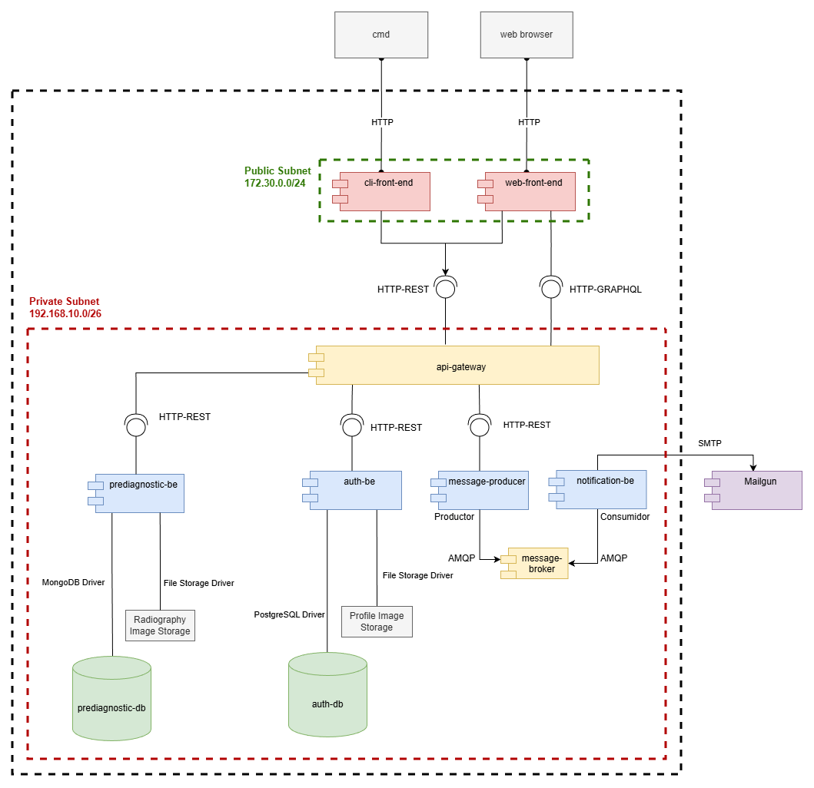
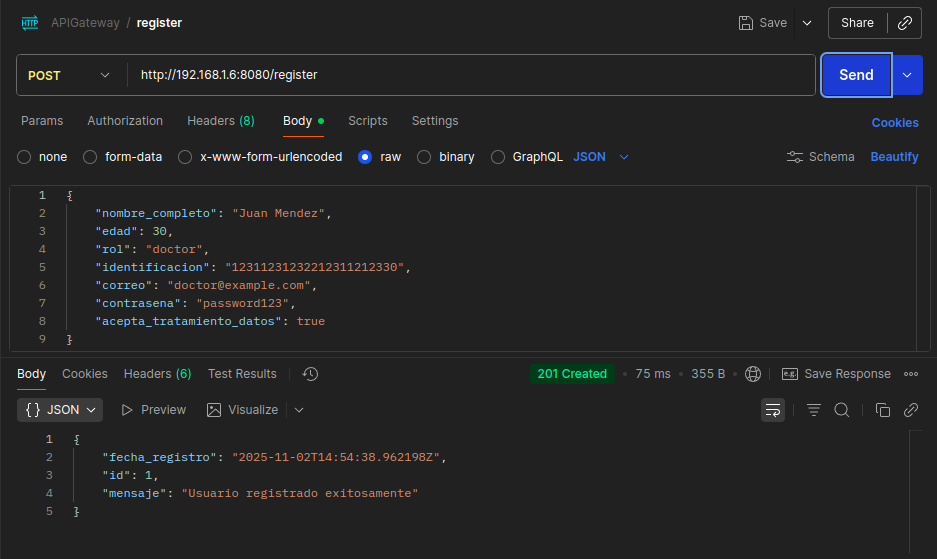
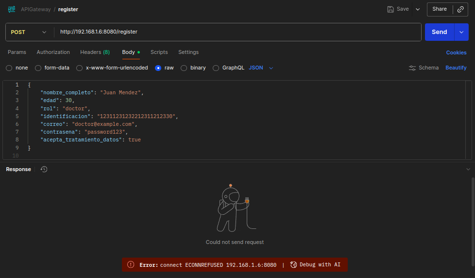
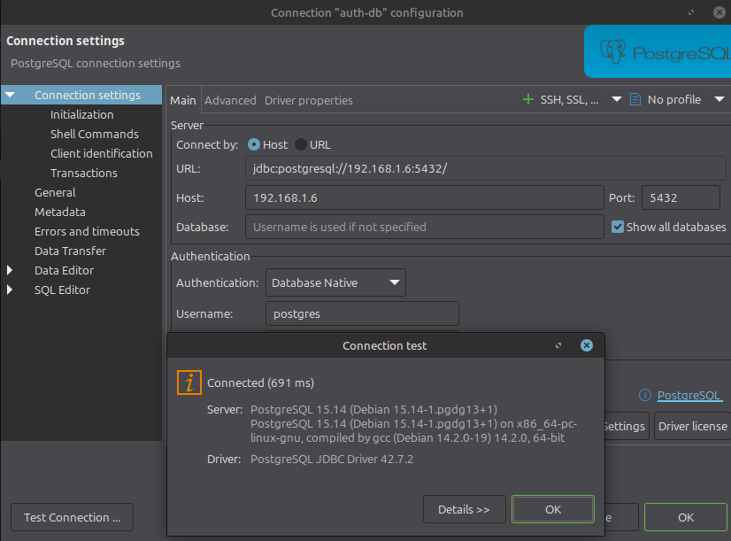

# 🚀 Delivery: Laboratory 5 - Network Segmentation Pattern
**Software Architecture** | Universidad Nacional de Colombia 🎓

---

## 👥 Team 1B

| **Member** | **Email** |
|------------|-----------|
| 🔹 Edinson Sanchez Fuentes | edsanchezf@unal.edu.co |
| 🔹 Adrian Ramirez Gonzalez | adramirez@unal.edu.co |
| 🔹 Sergio Nicolas Siabatto Cleves | ssiabatto@unal.edu.co |
| 🔹 Martin Polanco Barrero | mpolancob@unal.edu.co |
| 🔹 David Fernando Adames Rondon | dadames@unal.edu.co |
| 🔹 Julian Esteban Mendoza Wilches | jmendozaw@unal.edu.co |

## 📊 Network Segmentation Pattern Implementation

### Pattern Description
The Network Segmentation Pattern is a security architectural pattern that involves dividing a network into smaller segments or subnets to improve security and performance. This pattern helps control access between different parts of the system and limits the potential spread of security threats by creating isolated network zones for different types of components.

### Quality Scenario Addressed
- **Security Focus**: Confidentiality and Access Control
- **Stimulus**: Potential unauthorized access attempts between different system components
- **Response**: Network isolation prevents direct access to sensitive internal services through subnet segmentation
- **Metric**: Complete isolation of internal services from public access, with controlled access only through designated entry points

### Implementation Steps

1. Network definition

   The deployment uses two Docker networks defined in the docker compose: a single private subnet and a public subnet. The private network is defined as 192.168.10.0/26 and each container IP is automatically assigned from this range by the Docker Compose. The public network is 172.30.0.0/24 and is used only for services that need external exposure.

2. Logical Service Organization

   - Private network (192.168.10.0/26): backend services, databases and the message broker. IP assignment inside this subnet is automatic; there are no predefined IP ranges or segments within the private network.
   - Public network (172.30.0.0/24): used only by services that must be externally reachable (web front-end and CLI front-end). Those services are attached to both networks so they can reach internal components and also accept external connections.

   Network verification highlights:
   - The private network is marked `internal: true` so containers attached to it are not routable from the outside network by default.
   - Only frontend services are exposed on the public network; backend services remain isolated on the private subnet.

### Architectural View

For this lab we used the **Component and Connector View** to represent/illustrate the different network subnets and what components are located in each subnet:



#### Network Segmentation Details

1. **Public Network Access (172.30.0.0/24)**
   - Web and CLI frontends exposed to public network
   - Acts as entry point for user interactions

2. **Private Network (192.168.10.0/26)**
   - The private network hosts backend services, databases and the message broker. There are no manual sub-segments defined inside this subnet; Docker Compose assigns IPs automatically within the range.

3. **Security Controls**
   - API Gateway as central access control point
   - Databases accessible only through their respective services
   - Network isolation through internal flag
   - Controlled communication paths

### Configuration Details

```yaml
networks:
   private:
      ipam:
         driver: default
         config:
            - subnet: 192.168.10.0/26    # Internal services network
      internal: true                    # Ensures network isolation from external access
      labels:
         description: "Backend and Data Services Network"

   public:
      ipam:
         driver: default
         config:
            - subnet: 172.30.0.0/24      # External access network
      labels:
         description: "Frontend Public Access Network"
```

This configuration:
- Defines the two subnets used by the deployment
- Keeps backend services isolated by using `internal: true` on the private network
- Allows Docker to assign container IPs automatically within the private subnet

How components are attached to networks (example)

In `docker-compose.yml` each service declares the networks it belongs to. Below is a minimal example showing a backend service attached only to the private network and a web frontend attached to both private and public networks:

```yaml
services:
   api-gateway:
      build: ./api-gateway
      container_name:  api-gateway
      ports:
         - "8080:8080"
      depends_on:
         - auth-db
      networks:
         - private

   web-front-end:
      build: ./web-front-end
      container_name: web-front-end
      ports:
         - "3000:3000"
      networks:
         - private
         - public
```

Notes:
- A service listed under `private` is only attached to the internal subnet and will not be reachable via the public network.
- A service listed under both `private` and `public` can access internal services and also accept external requests through the host's published ports.

### Results and improvements

1. Network placement and addressing
   - The deployment uses two networks only: a private network and a public network. There are no manually defined internal segments inside the private subnet.
   - Container IPs are assigned automatically by Docker Compose within the configured subnets; this deployment does not rely on fixed/static IP allocations.

2. Security benefits
   - The private network is marked `internal: true`, which ensures that internal services are isolated from outside networks by default.
   - The public network is used exclusively by services that must be externally reachable (web front-end and CLI front-end).

3. Access control and exposure
   - Frontend services have dual-network presence so they can reach internal services while also accepting external requests through the host.
   - The API Gateway is the intended central access point for backend functionality when exposure is required.
   - To permit external access to a service, the host port must be published in `docker-compose.yml`.

#### Connectivity tests and observations

We performed a set of connectivity tests from a different machine on the same wi-fi network to verify access to services running in the Docker host. Results and key observations follow.

- Test A — API Gateway (HTTP POST /register)
   - Request URL used from the remote machine: `http://192.168.1.6:8080/register`.
   - Result: Two contrasting outcomes were observed:
      - When subnetting / network isolation was not applied (no `internal` enforcement), the gateway responded `201 Created` with a JSON body confirming registration — the host port was reachable from the remote machine.

         

      - When subnetting / network isolation was enabled (private network marked `internal: true`), the client received `ECONNREFUSED` (connection refused) because the service became inaccessible from the remote host.
         
         

   - Notes: the `ECONNREFUSED` in this scenario is expected when the private network is isolated. It indicates that the host/network configuration prevented access from the remote machine (correct behavior when isolation is enabled). If isolation is not intended, verify port publishing and host firewall rules.

- Test B — PostgreSQL (JDBC / DB client)
   - Connection target: `192.168.1.6:5432` (host LAN IP and published Postgres port).
   - Result: Two contrasting outcomes were observed:
      - When subnetting / network isolation was not applied, the DB client connected successfully (JDBC / DBeaver connection test succeeded) using `192.168.1.6:5432`.

         

      - When subnetting / network isolation (private `internal: true`) was enabled, the connection attempt returned “Connection refused” because the DB was not reachable from the remote machine.
         
         

   - Notes: this demonstrates the effect of enabling the private network isolation: it prevents remote access even if the port is mapped, depending on host/network rules. To allow remote DB access, ensure the service is intentionally published on the host and firewall rules permit the connection.

Screenshots were taken during the tests showing a successful `201 Created` response, an `ECONNREFUSED` Postman error, a successful DB connection test, and a later DB connection refusal.

### Recommendations

- Properly define the subnets in `docker-compose.yml` (e.g., `192.168.10.0/26` and `172.30.0.0/24`) so Docker assigns IPs automatically and the topology is clear.
- Emphasize and keep the `internal: true` flag on the private network — without this flag components could be accessible from unwanted networks.

These recommendations are already implemented in the current configuration of our system.
