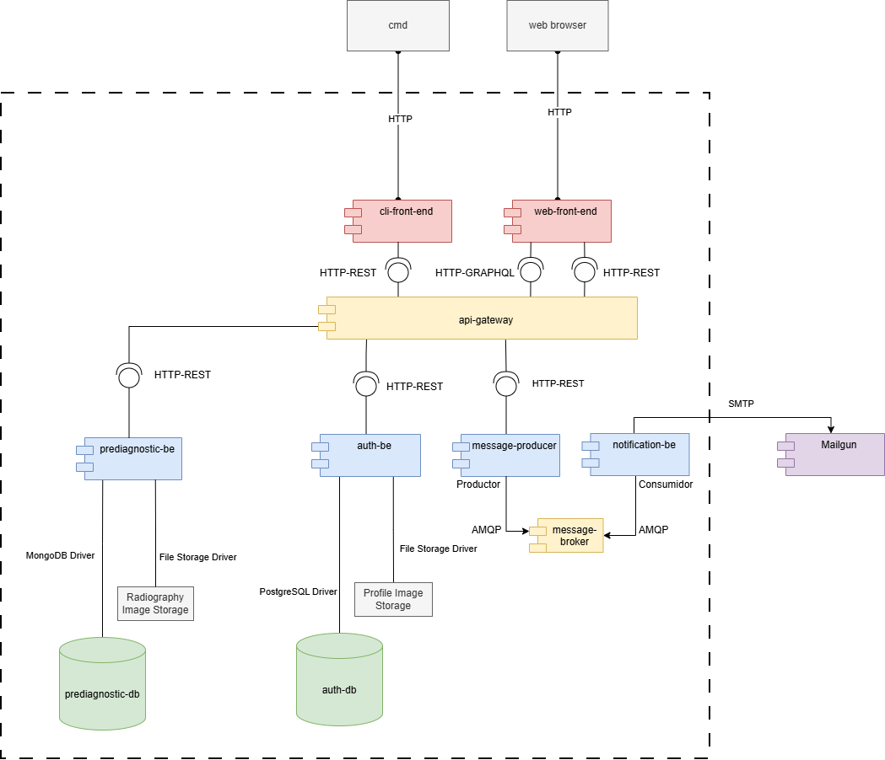
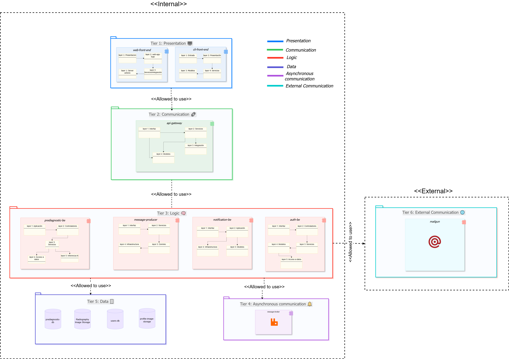

# 🚀 Delivery: Prototype 2
**Software Architecture** | Universidad Nacional de Colombia 🎓

---

## 👥 Team 1B

| **Member** | **Email** |
|------------|-----------|
| 🔹 Edinson Sanchez Fuentes | edsanchezf@unal.edu.co |
| 🔹 Adrian Ramirez Gonzalez | adramirez@unal.edu.co |
| 🔹 Sergio Nicolas Siabatto Cleves | ssiabatto@unal.edu.co |
| 🔹 Martin Polanco Barrero | mpolancob@unal.edu.co |
| 🔹 David Fernando Adames Rondon | dadames@unal.edu.co |
| 🔹 Julian Esteban Mendoza Wilches | jmendozaw@unal.edu.co |

## Neuomodiagnostics

---

## 🩺 Software System: **NeumoDiagnostics**

### 📋 Overview
**NeumoDiagnostics** is an AI-powered support platform designed to assist doctors in reviewing patient radiographs for pneumonia detection. Our system integrates advanced machine learning with comprehensive patient management features.

> ⚠️ **Important Note**: This model is designed to support, not replace, medical judgment. The final diagnosis always remains with the healthcare professional.

---

---

## 🏗️ **Architectural Structures**

Our NeumoDiagnostics system employs multiple architectural views to ensure comprehensive documentation and understanding of the system's design. Each view provides unique insights into different aspects of the architecture.

---

### 🔗 **Component and Connector (C&C) Structure**

#### 📊 **C&C View**
*Visual representation of system components and their interconnections*

#### **🎯 Description of Architectural Elements and Relations:**
This view describes runtime components, the interfaces they provide/require, and the connectors between them (see figure). It focuses on communication paths and protocols rather than implementation internals.

- Clients
	- `web-front-end` (Next.js): UI for doctors and patients.
		- Connectors: HTTP-GraphQL to `api-gateway` for data queries/mutations; HTTP-REST to `api-gateway` for authentication and file uploads when required by the flow.
	- `cli-front-end` (Rust): Command-line client as a secondary interface.
		- Connectors: HTTP-REST to `api-gateway`.

- Gateway and orchestration
	- `api-gateway` (Go): Single entry point, request validation, composition, and orchestration.
		- Provided interfaces: `/query` (GraphQL), REST endpoints for auth and simple listings.
		- Required connectors: HTTP-REST to `auth-be`, `prediagnostic-be`, and `message_producer`.

- Backend services
	- `auth-be` (Go): Identity and session services.
		- Provided: REST endpoints for login, logout, registration, profile image upload.
		- Required connectors: PostgreSQL driver to `auth-db`; File Storage Driver to `Profile Image Storage`.
	- `prediagnostic-be` (Python): Imaging and (pre)diagnostic workflows.
		- Provided: REST endpoints for radiograph upload, prediction, case queries, and diagnosis registration.
		- Required connectors: MongoDB driver to `prediagnostic-db`; File Storage Driver to `Radiography Image Storage`.
	- `message_producer` (Go): Publishes domain messages.
		- Provided: REST endpoint used by `api-gateway` to request a notification.
		- Required connectors: AMQP to `message-broker`.
	- `notification-be` (Go): Asynchronous notifications consumer.
		- Provided: Background consumer.
		- Required connectors: AMQP subscription to `message-broker`; SMTP to `Mailgun` (external provider).

- Data stores and external services
	- `auth-db` (PostgreSQL): identity store accessed only by `auth-be` via DB driver.
	- `prediagnostic-db` (MongoDB): clinical documents accessed only by `prediagnostic-be` via MongoDB driver.
	- `message-broker` (AMQP): decouples producer and consumer via queues/topics.
	- `Mailgun` (SMTP): external email service used by `notification-be`.
	- `Radiography Image Storage` and `Profile Image Storage`: binary storage behind file drivers used by `prediagnostic-be` and `auth-be` respectively.

- Connector summary and directionality
	- HTTP-GraphQL: `web-front-end → api-gateway`.
	- HTTP-REST: `web-front-end → api-gateway`, `cli-front-end → api-gateway`, `api-gateway → (auth-be | prediagnostic-be | message_producer)`.
	- AMQP: `message_producer → message-broker → notification-be`.
	- SMTP: `notification-be → Mailgun`.
	- DB drivers: `auth-be → auth-db (PostgreSQL)`, `prediagnostic-be → prediagnostic-db (MongoDB)`.
	- File drivers: `prediagnostic-be → Radiography Image Storage`, `auth-be → Profile Image Storage`.

#### **🏛️ Description of Architectural Styles and Patterns Used:**
- **Client–Server:** browsers/CLI act as clients of the `api-gateway` server over HTTP.
- **API Gateway Pattern:** `api-gateway` exposes a unified surface for multiple backends and tailors responses for the UI (GraphQL + REST).
- **Layered Style (tiers):** Presentation (clients), Communication (gateway), Logic (backends), Data (datastores), Asynchronous (broker), and External (Mailgun). Connectors respect top-down usage between adjacent tiers.
- **Service-Based:** `auth-be`, `prediagnostic-be`, `notification-be`, and `message_producer` are independently deployable services with well-defined interfaces.
- **Broker Pattern (mediated messaging):** `message_producer` publishes messages to `message-broker`, `notification-be` consumes; the broker decouples producers and consumers and enables retry/DLQ.
- **GraphQL for client composition:** `web-front-end` queries only required fields via `/query` to avoid over-/under-fetching.
- **REST for transactional and internal calls:** stable contracts for authentication, uploads, predictions, and listings.
- **Externalized services via adapters:** storage drivers for images and SMTP integration with Mailgun decouple infrastructure concerns from core logic.
- **Security patterns:** JWT-based session propagation at the gateway and downstream authorization checks in services (enforced via REST/GraphQL middleware).

---

### �🚀 **Deployment Structure**

#### 🌐 **Deployment View**
*Infrastructure and deployment configuration overview*

**🎯 Description of Architectural Elements and Relations:**
- Hardware and software environment mapping
- Network topology and communication paths
- Resource allocation and distribution

**🏛️ Description of Architectural Patterns Used:**
- Deployment strategies and patterns
- Scalability and availability considerations

---

### 📚 **Layered Structure**

#### 🎂 **Layered View**
*Next you can look the layered view, we recommend you to make zoom to each one of the layers to view what components belong to each one and view the logic of each component.*

#### **🎯 Description of Architectural Elements and Relations:**

Our NeumoDiagnostics system is structured in **six distinct layers**, each with specific responsibilities and well-defined interactions:

---

##### 🖼️ **Layer 1: Presentation**
- **Purpose**: User interface and interaction management
- **Components**: 
  - 🌐 Web Front-end
  - 💻 CLI Front-end
- **Relations**: Generates requests that are forwarded to the Synchronous Communication layer

---

##### 🔄 **Layer 2: Synchronous Communication**
- **Purpose**: Real-time request routing and handling
- **Key Component**: 🚪 API Gateway
- **Relations**: 
  - Receives requests from Presentation layer
  - Routes requests to appropriate Logic layer components
  - Ensures synchronous communication patterns

---

##### ⚙️ **Layer 3: Logic**
- **Purpose**: Core business logic and system functionality
- **Components**: 
    - prediagnostic-be
    - message-producer
    - notifications-be
    - auth-be
- **Relations**: 
  - Processes requests from API Gateway
  - Exclusive access to system data
  - Implements main system functionalities

---

##### 📨 **Layer 4: Asynchronous Communication**
- **Purpose**: Non-blocking message handling
- **Technology**: 🐰 RabbitMQ (Message Broker)
- **Relations**: 
  - Manages asynchronous message queues
  - Enables system to continue processing while messages are queued
  - Supports decoupled component communication

---

##### 💾 **Layer 5: Data**
- **Purpose**: Data storage and integrity management
- **Components**: 
  - prediagnostic-db
  - radiography-image-storage
  - users-db
  - profile-image-storage
- **Relations**: Provides persistent storage for all system data

---

##### 🌐 **Layer 6: External Communication**
- **Purpose**: Integration with external services
- **Services**: 📧 Mailgun (Email API Platform)
- **Relations**: 
  - Extends system capabilities through external APIs
  - Handles communication with third-party services
  - Enables email notifications and external integrations

#### **🏛️ Description of architectural patterns used**
As we saw in the c&c view, we implemented several software architectural patterns, now we are going to check them in our layered view in order to have a better understand.

**T6 Layered pattern**: This organizational pattern organize our system in 6 layers (the one´s that are described above). Each layer must follow a hierarchical order.

**API Gateway Pattern**: This communication pattern is located at our Synchronous Layer (the second one from top to bottom). It acts as an intermediary between clients and a collection of our backend microservices and follows a hierarchy level.

**Broker pattern**:This communication pattern (asynchronous) is located in our Asynchronous Communication layer. However, we need to make a clarification here. As we know, this pattern is usually built with producer and consumer components, but the component that belongs to this layer is the broker — not the other two.

###  **Logic Layers**
As you can see there are logic layers inside each component
**🏛️ Description of Architectural Patterns Used:**
- Layered architecture implementation
- Separation of concerns principles

---

### 🧩 **Decomposition Structure**

#### 🔍 **Decomposition View**
*System breakdown into modules and their relationships*

#### **🎯 Description of Architectural Elements and Relations:**
- This view decomposes the system into implementation units (modules and submodules) and shows a pure “is part of” hierarchy. Each module encapsulates a specific set of functionalities, and submodules represent finer components within those modules.

- Modules and submodules (from the diagram) with their functionalities and implementation mapping to the repository under `Desarrollo/`:

	- Authentication module — implemented in `auth-be`
		- Session Management (is part of Authentication)
			- F1: Sign in
			- F2: Sign out
		- User Management (is part of Authentication)
			- F3: Register user
			- F4: Upload profile picture

	- Cases Management module — implemented in `prediagnostic-be` 
		- Query Management (is part of Cases Management)
			- F5: List pending cases
			- F6: List cases by patient
			- F7: List case by ID
		- Diagnostic Management (is part of Cases Management)
			- F8: Register medical diagnosis

	- Prediagnostic Management module — implemented in `prediagnostic-be`
		- Radiograph Management (is part of Prediagnostic Management)
			- F9: Upload radiograph
		- Prediagnostic Registration (is part of Prediagnostic Management)
			- F10: Register prediagnostic

	- Notifications Management module — implemented in `notification-be`
		- F11: Send notifications

- Relations: each submodule has a single parent (the module it belongs to) and encapsulates specific functionalities (F1 – F11). They're organized hierarchically to reflect their containment relationships. These functionalities are grouped according to their logical association within the system. 

- Intended uses of this view:
	- Communicate the functional structure to newcomers in digestible chunks (modules → submodules → functionalities).
	- Provide input for work assignment by module boundaries.
	- Reason about the impact and localization of changes (tree structure enables targeting the affected module/submodule without cross-module edits).
