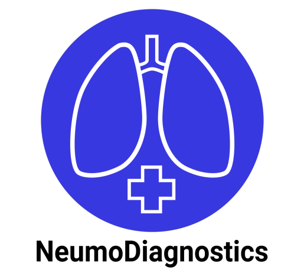
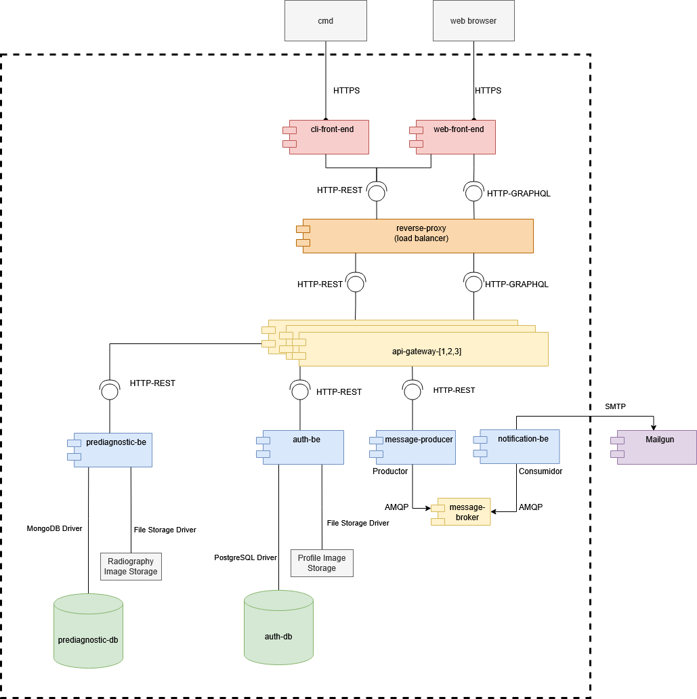
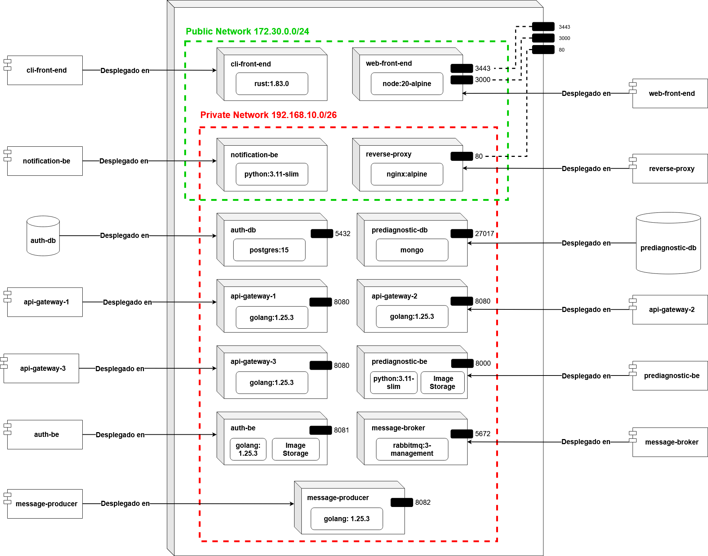
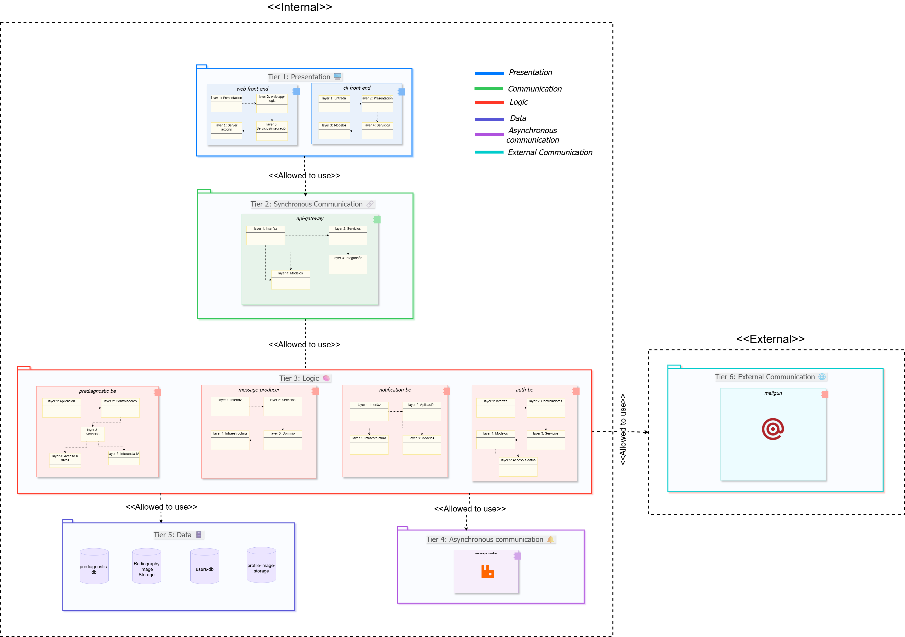

# 🚀 Delivery: Prototype 3
**Software Architecture** | Universidad Nacional de Colombia 🎓

---

## 👥 Team 1B

| **Member** | **Email** |
|------------|-----------|
| 🔹 Edinson Sanchez Fuentes | edsanchezf@unal.edu.co |
| 🔹 Adrian Ramirez Gonzalez | adramirez@unal.edu.co |
| 🔹 Sergio Nicolas Siabatto Cleves | ssiabatto@unal.edu.co |
| 🔹 Martin Polanco Barrero | mpolancob@unal.edu.co |
| 🔹 David Fernando Adames Rondon | dadames@unal.edu.co |
| 🔹 Julian Esteban Mendoza Wilches | jmendozaw@unal.edu.co |

## Neuomodiagnostics
<div align="center">



</div>
---

## 🩺 Software System: **NeumoDiagnostics**

### 📋 Overview
**NeumoDiagnostics** is an AI-powered support platform designed to assist doctors in reviewing patient radiographs for pneumonia detection. Our system integrates advanced machine learning with comprehensive patient management features.

> ⚠️ **Important Note**: This model is designed to support, not replace, medical judgment. The final diagnosis always remains with the healthcare professional.

---

---

## 🏗️ **Architectural Structures**

Our NeumoDiagnostics system employs multiple architectural views to ensure comprehensive documentation and understanding of the system's design. Each view provides unique insights into different aspects of the architecture.

---

### 🔗 **Component and Connector (C&C) Structure**


#### 📊 **C&C View**
*Visual representation of system components and their interconnections*

<div align="center">



</div>

#### **🎯 Description of Architectural Elements and Relations:**
This view describes runtime components, the interfaces they provide/require, and the connectors between them (see figure). It focuses on communication paths and protocols rather than implementation internals.

- User Interfaces
	- `web browser`: Web-based user interface for accessing the system through graphical interface.
		- Connectors: HTTPS to `web-front-end`.
	- `cmd` (Command Line): Terminal-based interface for system access via command-line tools.
		- Connectors: HTTPS to `cli-front-end`.

- Clients
	- `web-front-end` (Next.js): UI for doctors and patients.
		- Connectors: HTTP-REST to `reverse-proxy` for authentication and file uploads; HTTP-GRAPHQL to `reverse-proxy` for data queries/mutations.
	- `cli-front-end` (Rust): Command-line client as a secondary interface.
		- Connectors: HTTP-REST to `reverse-proxy`.

- Load Balancer and Security Layer
	- `reverse-proxy` (NginX): Acts as load balancer and security gateway. Single entry point for all client requests.
		- Provided interfaces: HTTP endpoints for REST and GraphQL.
		- Required connectors: HTTP-REST and HTTP-GRAPHQL to multiple `api-gateway` instances (load balanced).
		- Functions: SSL/TLS termination, request filtering, load distribution across API Gateway instances.

- Gateway and orchestration
	- `api-gateway` [1,2,3] (Go): Multiple instances for high availability. Single entry point for backend services, request validation, composition, and orchestration.
		- Provided interfaces: `/query` (GraphQL), REST endpoints for auth and simple listings.
		- Required connectors: HTTP-REST to `auth-be`, `prediagnostic-be`, and `message_producer`.

- Backend services
	- `auth-be` (Go): Identity and session services.
		- Provided: REST endpoints for login, logout, registration, profile image upload.
		- Required connectors: PostgreSQL driver to `auth-db`; File Storage Driver to `Profile Image Storage`.
	- `prediagnostic-be` (Python): Imaging and (pre)diagnostic workflows.
		- Provided: REST endpoints for radiograph upload, prediction, case queries, and diagnosis registration.
		- Required connectors: MongoDB driver to `prediagnostic-db`; File Storage Driver to `Radiography Image Storage`.
	- `message_producer` (Go): Publishes domain messages.
		- Provided: REST endpoint used by `api-gateway` to request a notification.
		- Required connectors: AMQP to `message-broker`; File Storage Driver for temporary storage.
	- `notification-be` (Go): Asynchronous notifications consumer.
		- Provided: Background consumer.
		- Required connectors: AMQP subscription to `message-broker`; SMTP to `Mailgun` (external provider).

- Data stores and external services
	- `auth-db` (PostgreSQL): identity store accessed only by `auth-be` via DB driver.
	- `prediagnostic-db` (MongoDB): clinical documents accessed only by `prediagnostic-be` via MongoDB driver.
	- `message-broker` (AMQP): decouples producer and consumer via queues/topics.
	- `Mailgun` (SMTP): external email service used by `notification-be`.
	- `Radiography Image Storage` and `Profile Image Storage`: binary storage behind file drivers used by `prediagnostic-be` and `auth-be` respectively.

- Connector summary and directionality
	- HTTPS: `web browser → web-front-end`, `cmd → cli-front-end`.
	- HTTP-REST: `cli-front-end → reverse-proxy → api-gateway [1,2,3]`.
	- HTTP-GRAPHQL: `web-front-end → reverse-proxy → api-gateway [1,2,3]`.
	- HTTP-REST: `web-front-end → reverse-proxy → api-gateway [1,2,3]` (for auth and uploads).
	- HTTP-REST (internal): `api-gateway → (auth-be | prediagnostic-be | message_producer)`.
	- AMQP: `message_producer → message-broker → notification-be`.
	- SMTP: `notification-be → Mailgun`.
	- DB drivers: `auth-be → auth-db (PostgreSQL)`, `prediagnostic-be → prediagnostic-db (MongoDB)`.
	- File drivers: `prediagnostic-be → Radiography Image Storage`, `auth-be → Profile Image Storage`, `message_producer → File Storage`.

#### **🏛️ Description of Architectural Styles and Patterns Used:**
- **Client–Server:** browsers/CLI act as clients connecting to the system through the reverse proxy.
- **Reverse Proxy Pattern:** NginX serves as the single entry point, providing SSL/TLS termination, request filtering, and load balancing capabilities.
- **Load Balancer Pattern:** Weighted Round-Robin algorithm distributes requests across multiple `api-gateway` instances [1,2,3] for high availability and performance.
- **API Gateway Pattern:** Multiple `api-gateway` instances expose a unified surface for multiple backends and tailor responses for the UI (GraphQL + REST).
- **Layered Style (tiers):** Presentation (clients), Security/Load Balancing (reverse-proxy), Communication (gateway), Logic (backends), Data (datastores), Asynchronous (broker), and External (Mailgun). Connectors respect top-down usage between adjacent tiers.
- **Service-Based:** `auth-be`, `prediagnostic-be`, `notification-be`, and `message_producer` are independently deployable services with well-defined interfaces.
- **Broker Pattern (mediated messaging):** `message_producer` publishes messages to `message-broker`, `notification-be` consumes; the broker decouples producers and consumers and enables retry/DLQ.
- **GraphQL for client composition:** `web-front-end` queries only required fields via `/query` to avoid over-/under-fetching.
- **REST for transactional and internal calls:** stable contracts for authentication, uploads, predictions, and listings.
- **Externalized services via adapters:** storage drivers for images and SMTP integration with Mailgun decouple infrastructure concerns from core logic.
- **Security patterns:** SSL/TLS at reverse proxy level, JWT-based session propagation at the gateway and downstream authorization checks in services (enforced via REST/GraphQL middleware).

---

### 🚀 **Deployment Structure**

#### 🌐 **Deployment View**
*Infrastructure and deployment configuration overview*

<div align="center">



</div>

#### **🎯 Description of Architectural Elements and Relations:**
This view describes how the system is packaged and executed using Docker Compose on a single host. All containers share Docker’s default bridge network, enabling service-to-service communication by DNS name (the Compose service name). External clients access the stack through host-exposed ports.

- Runtime environment
	- Orchestration: Docker Compose
	- Network: default bridge network (private). Services resolve each other by name and communicate over the internal network. Host-only ingress is via published ports.

- Containers (services) and exposed ports (host:container)
	- web-front-end (Next.js UI): 3000:3000
	- api-gateway (Go, API Gateway Pattern): 8080:8080
	- auth-be (Go, Authentication Service): 8081:8081
	- prediagnostic-be (Python, Prediagnostic API): 8000:8000
	- message_producer (Go, AMQP producer): 8082:8082
	- notification-be (Python, AMQP consumer + SMTP)
	- message-broker (RabbitMQ): 5672:5672 (AMQP), 15672:15672 (management UI)
	- auth-db (PostgreSQL 15): 5432:5432
	- prediagnostic-db (MongoDB): 27017:27017

- Data stores and initialization
	- auth-db uses an initialization script mounted at `/docker-entrypoint-initdb.d/inicializacion_auth_db.sql` to seed the schema.
	- prediagnostic-db runs as a plain MongoDB instance.
	- Radiography Image Storage and Profile Image Storage are currently implicit (filesystem inside `prediagnostic-be` and `auth-be` containers). As configured, these are ephemeral; persistence across container rebuilds would require named volumes or bind mounts.

- Service dependencies and communication paths
	- api-gateway → auth-be, prediagnostic-be, message_producer over HTTP (internal network).
	- prediagnostic-be → prediagnostic-db (MongoDB driver).
	- auth-be → auth-db (PostgreSQL driver).
	- message_producer → message-broker (AMQP) publishes notification requests.
	- notification-be ← message-broker (AMQP) consumes messages and sends emails via SMTP (Mailgun, external).
	- Clients (web-front-end and CLI) access only api-gateway from outside through the mapped host ports.

- Compose attributes relevant to ordering
	- depends_on used for api-gateway → auth-db and prediagnostic-be → prediagnostic-db to ensure DBs start before dependent services. Application-level retries are still recommended for robustness.

#### **🏛️ Description of Architectural Patterns Used:**
- Container-per-Service: each component runs in its own container with independent build context.
- Database-per-Service: `auth-db` (PostgreSQL) and `prediagnostic-db` (MongoDB) are dedicated to their owning services.
- API Gateway Pattern: `api-gateway` is the single ingress for synchronous traffic (REST/GraphQL), isolating internal topology.
- Broker Pattern: asynchronous integration via RabbitMQ decouples producers (`message_producer`) from consumers (`notification-be`).
- Private Network / Internal-only Services: all inter-service calls occur on the Docker bridge network; only selected ports are published to the host.
- Configuration as Code: environment is declared in `docker-compose.yml`; `notification-be` reads configuration from an `.env` file; `auth-db` is initialized via a mounted SQL script.

Scalability and availability considerations
- Persistence: introduce named volumes for Radiography/Profile image storage to ensure durability across container restarts and deploys.

---

### 📚 **Layered Structure**

#### 🎂 **Layered View**
*Next you can look the layered view, we recommend you to make zoom to each one of the layers to view what components belong to each one and view the logic of each component.*

<div align="center">



</div>

#### **🎯 Description of Architectural Elements and Relations:**

Our NeumoDiagnostics system is structured in **seven distinct layers** (tiers), each with specific responsibilities and well-defined interactions:

---

##### 🖼️ **Layer 1: Presentation**
- **Purpose**: User interface and interaction management
- **Components**: 
  - Web Front-end (Next.js)
  - CLI Front-end (Rust)
- **Relations**: Generates requests that are forwarded to the Load Balancing layer

---

##### 🔄 **Layer 2: Load Balancing and Reverse Proxy**
- **Purpose**: Security gateway, SSL/TLS termination, and request distribution
- **Key Component**: Reverse Proxy (NginX) configured as load balancer
- **Relations**: 
  - Receives all incoming requests from Presentation layer
  - Distributes requests across multiple API Gateway instances using Weighted Round-Robin
  - Provides SSL/TLS encryption and request filtering
  - Acts as single entry point for security

---

##### � **Layer 3: Synchronous Orchestration**
- **Purpose**: Real-time request routing and orchestration
- **Key Component**: API Gateway [instances 1, 2, 3] (Go)
- **Relations**: 
  - Receives load-balanced requests from Reverse Proxy
  - Routes requests to appropriate Logic layer components
  - Ensures synchronous communication patterns
  - Validates and composes requests

---

##### ⚙️ **Layer 4: Logic**
- **Purpose**: Core business logic and system functionality
- **Components**: 
    - prediagnostic-be (Python)
    - message-producer (Go)
    - notification-be (Go)
    - auth-be (Go)
- **Relations**: 
  - Processes requests from API Gateway instances
  - Exclusive access to system data through Data layer
  - Implements main system functionalities
  - Publishes events to Asynchronous Communication layer

---

##### 📨 **Layer 5: Asynchronous Communication**
- **Purpose**: Non-blocking message handling
- **Technology**: Message Broker (RabbitMQ with AMQP)
- **Relations**: 
  - Manages asynchronous message queues between producer and consumer
  - Enables system to continue processing while messages are queued
  - Supports decoupled component communication

---

##### 💾 **Layer 6: Data**
- **Purpose**: Data storage and integrity management
- **Components**: 
  - prediagnostic-db (MongoDB)
  - radiography-image-storage (File Storage)
  - auth-db (PostgreSQL)
  - profile-image-storage (File Storage)
- **Relations**: Provides persistent storage for all system data, accessed exclusively by Logic layer components

---

##### 🌐 **Layer 7: External Communication**
- **Purpose**: Integration with external services
- **Services**: Mailgun (Email API Platform)
- **Relations**: 
  - Extends system capabilities through external APIs
  - Handles communication with third-party services
  - Enables email notifications and external integrations

#### 🏛️ **Description of architectural patterns used**
As we saw in the C&C view, we implemented several software architectural patterns. Now we are going to examine them in our layered view for better understanding.

**7-Tier Layered Pattern**: This organizational pattern organizes our system into 7 distinct layers (tiers) as described above. Each layer must follow a strict hierarchical order, where upper layers can only communicate with adjacent lower layers.

**Reverse Proxy Pattern**: Located in Layer 2 (Load Balancing and Reverse Proxy), NginX acts as the single entry point for all client requests. It provides SSL/TLS termination, request filtering, and security enforcement before routing to backend services.

**Load Balancer Pattern**: Also in Layer 2, the reverse proxy implements a Weighted Round-Robin load balancing algorithm to distribute incoming requests across three API Gateway instances (Layer 3), ensuring high availability and optimal resource utilization.

**API Gateway Pattern**: This communication pattern is located in Layer 3 (Synchronous Orchestration). Multiple API Gateway instances act as intermediaries between the load balancer and backend microservices. They handle request composition, validation, and routing while following the hierarchical structure.

**Broker Pattern**: This asynchronous communication pattern is located in Layer 5 (Asynchronous Communication). The message broker (RabbitMQ) decouples producers (message_producer) from consumers (notification-be) through AMQP queues. The broker itself belongs to this layer, while producers and consumers reside in the Logic layer (Layer 4).


#### 🧠 **Logic Layers**
As you can see, there are logic layers within each component. In almost all components, we tried to build them using a Clean Architecture approach as the foundation for managing each component’s logic.

<div align="center">


</div>

Now, we’re going to briefly explain the responsibility of each layer. This explanation will be general, since this approach is applied in almost all components.

- **Presentation Layer (UI)** 🎨  
  Handles user interaction and displays information.  
  It sends user actions to the application layer.

- **Application Layer (Services / Use Cases)** ⚙️  
  Contains the business logic that coordinates entities and defines use cases.

- **Domain Layer (Models / Entities)** 🧠  
  Holds the core business rules and entities.  
  It’s completely independent from external concerns.

- **Infrastructure Layer** 🧩  
  Implements technical details such as database access, APIs, message brokers, and external services.

> **In short:** Infrastructure *implements*, Domain *defines*, Application *coordinates*, and Presentation *interacts*.

---

### 🧩 **Decomposition Structure**


#### 🔍 **Decomposition View**
*System breakdown into modules and their relationships*

<div align="center">


</div>

#### **🎯 Description of Architectural Elements and Relations:**
- This view decomposes the system into implementation units (modules and submodules) and shows a pure “is part of” hierarchy. Each module encapsulates a specific set of functionalities, and submodules represent finer components within those modules.

- Modules and submodules (from the diagram) with their functionalities and implementation mapping to the repository under `Desarrollo/`:

	- Authentication module — implemented in `auth-be`
		- Session Management (is part of Authentication)
			- F1: Sign in
			- F2: Sign out
		- User Management (is part of Authentication)
			- F3: Register user
			- F4: Upload profile picture

	- Cases Management module — implemented in `prediagnostic-be` 
		- Query Management (is part of Cases Management)
			- F5: List pending cases
			- F6: List cases by patient
			- F7: List case by ID
		- Diagnostic Management (is part of Cases Management)
			- F8: Register medical diagnosis

	- Prediagnostic Management module — implemented in `prediagnostic-be`
		- Radiograph Management (is part of Prediagnostic Management)
			- F9: Upload radiograph
		- Prediagnostic Registration (is part of Prediagnostic Management)
			- F10: Register prediagnostic

	- Notifications Management module — implemented in `notification-be`
		- F11: Send notifications

- Relations: each submodule has a single parent (the module it belongs to) and encapsulates specific functionalities (F1 – F11). They're organized hierarchically to reflect their containment relationships. These functionalities are grouped according to their logical association within the system. 

- Intended uses of this view:
	- Communicate the functional structure to newcomers in digestible chunks (modules → submodules → functionalities).
	- Provide input for work assignment by module boundaries.
	- Reason about the impact and localization of changes (tree structure enables targeting the affected module/submodule without cross-module edits).

---

## 🎯 **Quality Attributes**

### 🔒 **Security**

#### **Security Scenarios**

Our system implements four critical security scenarios to ensure data protection, user authentication, and secure communications:

##### **Scenario 1: Network Segmentation**

<div align="center">


</div>

**Description:**
- **Source (Fuente):** Person using their own computer
- **Stimulus (Estímulo):** Direct request sent to some component of the private network (Back-end and databases)
- **Artifact (Artefacto):** Private network components (Back-end and databases)
- **Environment (Ambiente):** System during its normal execution
- **Response (Respuesta):** Request rejection
- **Response Measure (Medición de la respuesta):** Number of requests made to private network components that have been rejected

**Applied Pattern:** Network Segmentation Pattern

---

##### **Scenario 2: Reverse Proxy**

<div align="center">


</div>

**Description:**
- **Source (Fuente):** External attacker or poorly maintained client
- **Stimulus (Estímulo):** Multiple malicious requests attempting to access backend services and overload the API Gateway
- **Artifact (Artefacto):** NginX configured as the single entry point
- **Environment (Ambiente):** System during its normal execution
- **Response (Respuesta):** The reverse proxy intercepts and blocks unauthorized access, filters and detects each request
- **Response Measure (Medición de la respuesta):** The reverse proxy registers and rejects illegitimate access, maintains and protects healthy instances

**Applied Pattern:** Reverse Proxy Pattern

---

##### **Scenario 3: Token Authentication (JWT)**

<div align="center">


</div>

**Description:**
- **Source (Fuente):** User without a valid JWT token
- **Stimulus (Estímulo):** Attempt to use any system functionality different from login or register
- **Artifact (Artefacto):** Set of functionalities that require authentication
- **Environment (Ambiente):** System during its normal execution
- **Response (Respuesta):** Rejection of login or register service attempt and redirection to the dashboard corresponding to the missing valid JWT token
- **Response Measure (Medición de la respuesta):** Number of requests rejected due to missing valid JWT token

**Applied Pattern:** Token-Based Authentication (JWT)

---

##### **Scenario 4: Secure Channel (HTTPS/TLS)**

<div align="center">


</div>

**Description:**
- **Source (Fuente):** User with bad intentions
- **Stimulus (Estímulo):** Attempt to intercept, read, or modify information transmitted between client and server during normal system communication
- **Artifact (Artefacto):** Secure communication channel implemented with HTTPS/TLS between client and reverse proxy
- **Environment (Ambiente):** System during its normal operation
- **Response (Respuesta):** Protection of communication through TLS encryption and rejection of any interception or data manipulation attempts
- **Response Measure (Medición de la respuesta):** Interception attempts blocked and traffic completely encrypted

**Applied Pattern:** Secure Channel Pattern (HTTPS/TLS)

---

#### **Applied Architectural Tactics**

Our system implements multiple security tactics organized by their defensive objectives:

##### **Resist Attacks**

- **Authenticate Actor:** JWT-based authentication system validates user identity before granting access to protected resources. Implemented in `auth-be` service with token validation at the API Gateway level.

- **Authorize Actors:** Role-based authorization checks ensure users can only access functionalities appropriate to their roles (doctors vs. patients). Enforced through middleware in the API Gateway and backend services.

- **Limit Access:** Network segmentation isolates private components (backend services and databases) from direct external access. Only the API Gateway is exposed as the single entry point.

- **Limit Exposure:** The API Gateway pattern minimizes the attack surface by exposing only necessary endpoints and hiding internal service topology from external clients.

- **Encrypt Data:** TLS/HTTPS encryption protects all data in transit between clients and the reverse proxy, and between internal services when handling sensitive information.

- **Separate Entities:** Microservices architecture separates concerns into independent services (`auth-be`, `prediagnostic-be`, `notification-be`), limiting the blast radius of potential security breaches.

##### **React to Attacks**

- **Revoke Access:** System can invalidate JWT tokens when suspicious activity by a admin is detected or when users log out, preventing further unauthorized access.

**Detect Attacks**

- **Verify Message Integrity:** API Gateway validates request structure and content before forwarding to backend services, detecting malformed or malicious payloads.

---

#### **Applied Architectural Patterns**

- **Network Segmentation Pattern:** Isolation of private network components from direct external access
- **Reverse Proxy Pattern:** NginX as single entry point for filtering, load balancing, and security enforcement
- **Token-Based Authentication Pattern:** JWT for secure session management and stateless authentication
- **Secure Channel Pattern:** HTTPS/TLS encryption for all client-server communications


---

### ⚡ **Performance and Scalability**

#### **Performance Scenarios**

Our system implements performance and scalability scenarios to ensure optimal resource utilization and response times under varying load conditions:

##### **Scenario 1: Load Balancer / Weighted Round-Robin**

<div align="center">


</div>

**📋 Description:**
- **Source (Fuente):** 300 users
- **Stimulus (Estímulo):** Sending 300 different requests in 1 second
- **Artifact (Artefacto):** System
- **Environment (Ambiente):** System during its normal execution
- **Response (Respuesta):** Distribution of requests among the 3 API Gateway instances according to the Weighted Round-Robin algorithm
- **Response Measure (Medición de la respuesta):** Number of requests handled by each API Gateway instance

**Applied Pattern:** Load Balancer

---

#### **Applied Architectural Tactics**

Our system implements performance tactics to optimize resource utilization and response times:

**Control Resource Demand**

- **Manage Work Requests:** The system processes incoming requests efficiently through the load balancer, distributing workload across multiple instances.

**Manage Resources**

- **Increase Resources:** Multiple API Gateway instances (3 instances) are deployed to handle increased load and provide redundancy.
- **Introduce Concurrency:** The Weighted Round-Robin algorithm distributes requests across multiple instances, enabling parallel processing of requests.
- **Maintain Multiple Copies of Computations:** Three instances of the API Gateway run simultaneously to handle concurrent requests without blocking.
- **Schedule Resources:** Weighted Round-Robin scheduling algorithm manages how requests are distributed among available API Gateway instances based on their weights and current load.

---

#### **Applied Architectural Patterns**

- **Load Balancer Pattern:** Weighted Round-Robin algorithm distributes incoming requests across multiple API Gateway instances
---

#### **Performance Testing Analysis and Results**


---

## **Prototype**

### **Instructions for Deploying the Software System Locally**

*Follow these steps to deploy the NeumoDiagnostics system locally on your machine*

---

### 📋 **Prerequisites**

<div align="center">

> ⚠️ **Important**: Ensure you have the following requirements installed before proceeding

</div>

<table>
<tr>
<td align="center" width="25%">

<br><strong>Docker Desktop</strong>
<br><a href="https://www.docker.com/products/docker-desktop">📥 Download</a>
</td>
<td align="center" width="25%">

<br><strong>Git</strong>
<br><a href="https://git-scm.com/">📥 Download</a>
</td>
<td align="center" width="25%">

<br><strong>Terminal Access</strong>
<br>Command Prompt / WSL
</td>
<td align="center" width="25%">

<br><strong>Linux Environment</strong>
<br>Native or WSL
</td>
</tr>
</table>

---

### 🛠️ **Step-by-Step Setup**

#### 1️⃣ **Clone the Repository**

<div align="center">

**📁 Repository:** [`unobeswarch/NeumoDiagnostics-Docker`](https://github.com/unobeswarch/NeumoDiagnostics-Docker.git)

</div>

```bash
# Clone the NeumoDiagnostics Docker repository
git clone https://github.com/unobeswarch/NeumoDiagnostics-Docker.git
```

#### 2️⃣ **Navigate to Project Directory**

```bash
# Enter the project directory
cd NeumoDiagnostics-Docker
```

#### 3️⃣ **Create certificates for Secure Channel Pattern**

Go to NeumoDiagnostics-Docker/reverse-proxy and open a terminal to execute the following command:

```bash
# Linux
./scripts/generate-certs.sh
```
```bash
# Windows
scripts\generate-certs.bat
```
Then, return to NeumoDiagnostics-Docker folder

#### 4️⃣ **Setup Docker Environment**

> 🐧 **Note**: Open a terminal in your Linux distribution (you can use WSL on Windows)

```bash
# Navigate to the docker configuration folder and type
docker-compose up --build
```

---

<div align="center">

#### 🎉 **Ready to Deploy!**

</div>