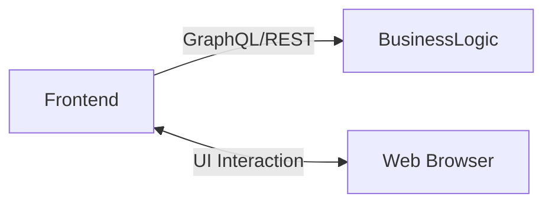
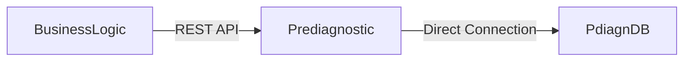
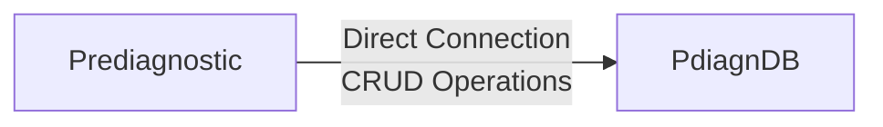
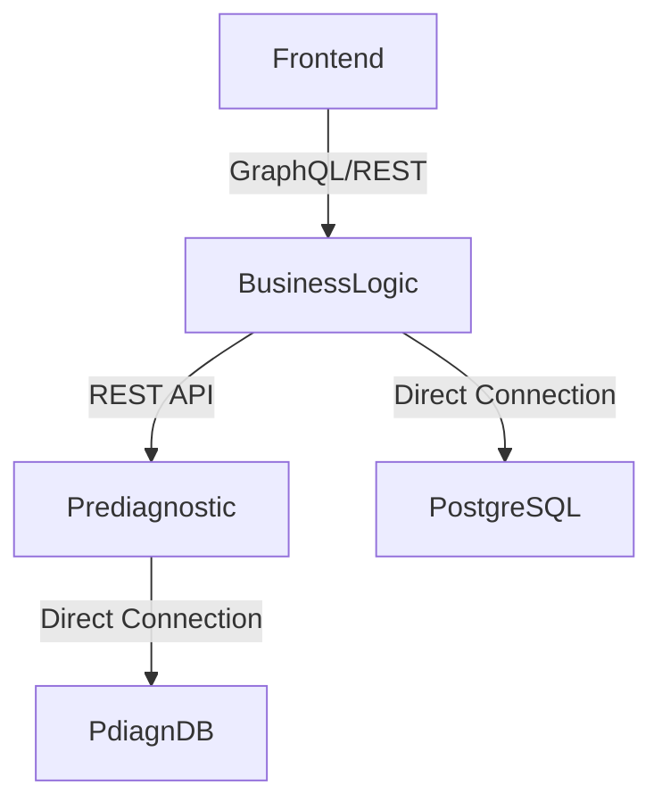
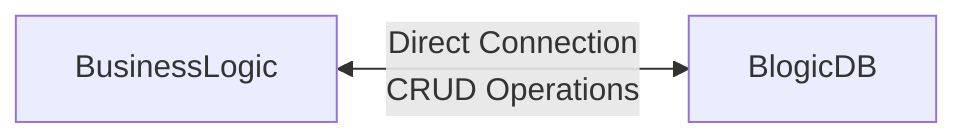

# 🚀 Delivery: Prototype 1
**Software Architecture** | Universidad Nacional de Colombia 🎓

---

## 👥 Team 1B

| **Member** | **Email** |
|------------|-----------|
| 🔹 Edinson Sanchez Fuentes | edsanchezf@unal.edu.co |
| 🔹 Adrian Ramirez Gonzalez | adramirez@unal.edu.co |
| 🔹 Sergio Nicolas Siabatto Cleves | ssiabatto@unal.edu.co |
|🔹Martin Polanco Barrero | mpolancob@unal.edu.co |
| 🔹 David Fernando Adames Rondon | dadames@unal.edu.co |
| 🔹 Julian Esteban Mendoza Wilches | jmendozaw@unal.edu.co |

## Logo:
<div align="center">


</div>
---

## 🩺 Software System: **NeumoDiagnostics**

### 📋 Overview
**NeumoDiagnostics** is an AI-powered support platform designed to assist doctors in reviewing patient radiographs for pneumonia detection. Our system integrates advanced machine learning with comprehensive patient management features.

> ⚠️ **Important Note**: This model is designed to support, not replace, medical judgment. The final diagnosis always remains with the healthcare professional.

### ✨ Key Features

#### 👤 **For Patients:**
- 📤 Upload radiographs in JPG format
- 📊 View all medical records by status (validated/processed)
- 🔍 Access detailed record information

#### 👨‍⚕️ **For Doctors:**
- 📋 Review pending evaluation cases
- 🎯 Select and examine individual cases
- ✅ Evaluate and validate diagnoses

---

## 🏗️ Architectural Structures

### 🔗 Component and Connector (C & C) Structure

#### 📊 **Architecture Diagram**
The following diagram illustrates our component and connector view:

<div align="center">


</div>

- Description of architectural styles used: We are using several architectural styles at both the connector and component levels. First let´s check the first ones:

### 🔧 **Client & Server**
Let´s remember first what is this style about: It is an architectural style in which the system’s functions are divided into two main roles: the client, which requests and consumes services, and the server, which processes the requests and provides the resources or functionalities. 
<div style="background-color: #f6f8fa; padding: 15px; border-radius: 8px; margin: 10px 0; color: #333333;">

**🎯 Why we adopted this style:**

*The Client-Server style was adopted because it allows a clear separation of responsibilities between clients (user interfaces or consuming applications) and the server (business logic and data management). This facilitates scalability, system maintenance, and enables multiple clients to access the same services in a centralized and controlled way. Moreover, it is a widely adopted model that relies on standard protocols such as HTTP, ensuring interoperability.*

</div>

**🔗 Client-Server Relations in our C&C View:**

| 🖱️ **Client** | ↔️ | 🖥️ **Server** |
|---------------|---|---------------|
| `front-end` | ➡️ | `businesslogic` |
| `businesslogic` | ➡️ | `blogicdb` |
| `businesslogic` | ➡️ | `prediagnostic` |
| `prediagnostic` | ➡️ | `pdiagndb` |

---

### 🔧 **Service-Based Architecture**

<div style="background-color: #fff8e1; padding: 15px; border-radius: 8px; border-left: 4px solid #ff9800; color: #333333;">

A service-based architecture was adopted since the main components of the system expose their functionality through reusable services with well-defined interfaces, enabling their consumption by other modules or applications. This approach provides **flexibility**, **scalability**, and **separation of concerns**, ensuring standardized and organized communication between the different components.

</div> 
<div style="background-color: #ffeaa7; padding: 10px; border-radius: 5px; margin: 10px 0; color: #333333;">

**⚠️ Important Note:** Although not all the characteristics of a microservices architecture are met (such as complete independence in deployment and persistence) for example, our BusinessLogic component exposes services through its interfaces, such as authentication, registration, and radiograph upload. Similarly, our PreDiagnostic component exposes services like pneumonia prediction, pre-diagnostic, and diagnostic. As we can see, although we are using a service-based approach, not all services are fully decoupled from the main component that holds them.

</div>

---

### 🌐 **REST Architectural Style**

<div style="background-color: #e8f5e8; padding: 15px; border-radius: 8px; border-left: 4px solid #28a745; color: #333333;">

The REST architectural style was implemented for services that demand a stable and predictable contract structure, as well as for internal communication where data over-fetching does not represent a critical concern.

</div>

#### 🔐 **Identity and Authorization Services**

<div style="background-color: #f8f9fa; padding: 10px; border-radius: 5px; margin: 10px 0; color: #333333;">

- **Implementation:** The implementation of REST is applied to the authorization (login) and registration services.

</div>

**📋 Justification:**

<div style="background-color: #fff3cd; padding: 12px; border-radius: 6px; border-left: 3px solid #ffc107; color: #333333;">

- **🔒 Fixed and Low Evolution Data Contract:**  
  The authentication and registration endpoints possess an inherently rigid data contract. The request and response formats for these transactional operations rarely change (e.g., username and password as input; session token as output).

- **🛡️ Simplicity and Robustness:**  
  REST, by offering a fixed structure and leveraging standard HTTP operations (POST, GET), ensures simple, robust integration with low coupling, which is ideal for these low-volatility services. The added complexity of a flexible querying engine like GraphQL is not justified when the required data is constant.

</div>

#### 🔄 **Inter-Component Communication**

<div style="background-color: #f8f9fa; padding: 10px; border-radius: 5px; margin: 10px 0; color: #333333;">

- **Implementation:** REST is utilized for internal communication between the Business Logic (BusinessLogic) component and the Prediagnostic (Prediagnostic) component.

</div>

**📋 Justification:**

<div style="background-color: #d1ecf1; padding: 12px; border-radius: 6px; border-left: 3px solid #17a2b8; color: #333333;">

- **📦 Need for Complete Data:**  
  The services defined in the Prediagnostic component require the transmission of complete and defined data sets for their correct operation. Flexibility in field selection is not a functional requirement within this internal processing context.

</div>

---

### ⚡ **GraphQL**

<div style="background-color: #f3e5f5; padding: 15px; border-radius: 8px; border-left: 4px solid #9c27b0; color: #333333;">

GraphQL was selected to manage communication between the Frontend (Client) and the Business Logic (BusinessLogic) component due to its ability to optimize data transfer and support variable information requirements.

</div>


**📋 Justification**

#### 🚫 **Resolution of Over-fetching:**

<div style="background-color: #fce4ec; padding: 12px; border-radius: 6px; margin: 10px 0; color: #333333;">

The primary reason for adopting GraphQL is its ability to allow the client to request only the specific data fields it needs (e.g., just the case ID and status, without the entire information of the case).

This optimizes performance, reduces server load, and minimizes bandwidth consumption, which is crucial for the user experience in dashboards with dynamic visualization requirements.

</div>

#### 🔄 **Dual Architecture Approach:**

<div style="background-color: #e1f5fe; padding: 15px; border-radius: 8px; border-left: 4px solid #00bcd4; color: #333333;">

This dual architecture ensures that the most appropriate tool is used for each task:

- **🔧 REST Benefits:** Leveraging the simplicity of REST for stable transactions.
- **⚡ GraphQL Benefits:** Taking advantage of the flexibility of GraphQL for variable data retrieval and efficiency in the presentation layer.

</div>

---

<div align="center">

# 🏗️ **Architectural Elements and Relations**

</div>

---

## 🎨 **Frontend Component**

<div align="center">
<table>
<tr>
<td width="20%"><strong>🔧 Technology</strong></td>
<td width="80%"><code>TypeScript + React (Next.js)</code></td>
</tr>
</table>
</div>

### 📋 **Description**
> 🎯 **Role**: Presentation component for end users (doctor and patient)

Provides role-oriented interfaces and flows for authentication, case review, visualization of pre-diagnostics, and registration of final diagnoses. Operates in a client–server relationship against businesslogic, consuming the services it exposes. Communication is carried out through two HTTP connectors with different styles (GraphQL and REST) depending on the need for flexibility or rigidity of the contract.

### 💡 **Technology Justification**
```
✅ React + TypeScript → Static typing and reusable components
✅ Next.js → Performance (hybrid SSR/CSR), file-based routing
✅ Middleware → Access control prior to rendering
✅ Stack Benefits → DX, testing, and load optimization
```

### 🎯 **Key Responsibilities**
- 🏠 **Dashboard Management** - Present dashboards and views by role (doctor/patient) and protected navigation
- 🔐 **Authentication** - Manage user authentication on the client (session state, login/logout, token validation)
- 📊 **GraphQL Integration** - Consume the GraphQL endpoint of businesslogic for queries and mutations with field selection
- 🔗 **REST Integration** - Consume REST endpoints for authentication/validation and operations with rigid contracts
- 📤 **File Upload** - Upload chest X-rays via REST (multipart/form-data) when required by the flow
- ✅ **Data Validation** - Validate client-side data and provide error handling and loading states

### 🌐 **Interfaces**
<details>
<summary><strong>🔍 Click to expand interface details</strong></summary>

| Interface Type | Description |
|---|---|
| **GraphQL API** | `businesslogic /query` - queries (getCases, caseDetail, preDiagnosticById) and mutations (createDiagnostic), with JWT injection in headers |
| **REST API** | `businesslogic` - /auth, /validation, and /businesslogic/cases; upload endpoint for files (multipart/form-data) |
| **Authentication** | Secure cookie storage for JWT and synchronization with the global front-end context |

</details>

### 🔄 **Relationships**


### ⚠️ **Boundaries**
> ❌ Does not implement clinical business logic or workflow orchestration  
> ❌ Does not persist data in databases; only maintains state in memory/local  
> ❌ Does not execute AI inference or process images beyond client-side validations  

---

## 🤖 **Prediagnostic Component**

<div align="center">
<table>
<tr>
<td width="20%"><strong>🔧 Technology</strong></td>
<td width="80%"><code>Python 3.x</code></td>
</tr>
</table>
</div>

### 📋 **Description**
> 🎯 **Role**: AI-powered microservice for chest X-ray analysis

Microservice specialized in executing AI inference for chest X-ray analysis and pneumonia detection. Acts as the access layer to the Machine Learning model and manages persistence of its results.

### 💡 **Technology Justification**
```
🐍 Python → Standard for ML/AI with mature ecosystem
📚 Libraries → Specialized libraries for simplified integration
🔧 Maintenance → Easy integration and maintenance
```

### 🎯 **Key Responsibilities**
- 🧠 **AI Inference** - Run AI model inference on radiographic images
- 📊 **Pre-diagnostics** - Generate pre-diagnostics with majority class probabilities
- 💾 **Data Persistence** - Persist pre-diagnostics and final medical diagnoses in pdiagndb
- 🔍 **Case Queries** - Provide case queries (individual, historical, lists for medical review)
- ⚡ **Performance** - Guarantee inference time p95 ≤ 5 seconds

### 🌐 **Interfaces**
<details>
<summary><strong>🔍 Click to expand interface details</strong></summary>

| Interface Type | Description |
|---|---|
| **REST/HTTP API** | Endpoints for prediction, case queries, medical diagnosis persistence, and service monitoring |
| **NoSQL Database** | MongoDB (prediagnosticdb) - Direct access for CRUD operations on pre-diagnostics and validated diagnoses |

</details>

### 🔄 **Relationships**


### ⚠️ **Boundaries**
> ❌ Does not implement business logic or workflow orchestration  
> ❌ Does not manage users, authentication, or roles  
> ❌ Does not interact directly with frontend clients  

---

## 🗄️ **PdiagnDB Component**

<div align="center">
<table>
<tr>
<td width="20%"><strong>🔧 Technology</strong></td>
<td width="80%"><code>Document-oriented NoSQL - MongoDB</code></td>
</tr>
</table>
</div>

### 📋 **Description**
> 🎯 **Role**: Specialized NoSQL database for clinical data

NoSQL database specialized in flexible and efficient storage of pre-diagnostics generated by the AI model and validated medical diagnoses. Provides document-oriented persistence for semi-structured data with high write and query volume.

### 💡 **Technology Justification**
```
📈 Performance → High read performance for frequent medical history queries
🔄 Flexibility → Schema evolution without complex migrations
📊 Scalability → Horizontal scalability supports accelerated growth
🗃️ Structure → Handles semi-structured data and variable AI model results
```

### 🎯 **Key Responsibilities**
- 💾 **AI Data Storage** - Persist AI model-generated pre-diagnostics with flexible structure
- 🏥 **Medical Records** - Persist validated medical diagnoses with clinical feedback
- 📚 **History Access** - Provide efficient access to patient histories and pending review cases
- 🔍 **Traceability** - Maintain traceability of model results through versioning and timestamps
- ⚡ **Performance** - Support high-volume queries with low latency

### 🌐 **Interfaces**
<details>
<summary><strong>🔍 Click to expand interface details</strong></summary>

| Collection | Description |
|---|---|
| **prediagnosticos** | Stores inference results, probabilities, image metadata, and case status |
| **diagnosticos** | Contains medical validations, clinical observations, and approvals |

**Access Method**: Native MongoDB driver (PyMongo) from prediagnostic

</details>

### 🔄 **Relationships**


### ⚠️ **Boundaries**
> ❌ Stores only data related to pre-diagnostics and medical diagnoses  
> ❌ Does not manage user information, credentials, or roles  
> ❌ Does not contain data processing or transformation logic  
> ❌ Does not implement business rules or complex validations  
---  
---

## ⚙️ **BusinessLogic Component**

<div align="center">
<table>
<tr>
<td width="20%"><strong>🔧 Technology</strong></td>
<td width="80%"><code>Go</code></td>
</tr>
</table>
</div>

### 📋 **Description**
> 🎯 **Role**: System orchestration and gateway service

System orchestration and gateway service. Exposes a unified interface to the frontend, applies business rules, validates and authorizes requests, and coordinates communication with the Prediagnostic microservice and its own database. Does not perform inference or persist clinical data.

### 💡 **Technology Justification**
```
⚡ Performance → High performance and native concurrency for network I/O
🔒 Type Safety → Static typing for stable contracts
📦 Deployment → Small binaries for container deployment
🌐 Ecosystem → Mature ecosystem for HTTP/GraphQL
🚀 Architecture → Facilitates building lightweight central component
```

### 🎯 **Key Responsibilities**
- 🔗 **GraphQL Gateway** - Expose a unified GraphQL endpoint (/query) for queries and mutations of cases, pre-diagnostics, and diagnostics
- 🛡️ **Authentication** - Provide rigid-contract REST endpoints for authentication/registration/validation (/auth, /validation)
- 🔄 **Service Orchestration** - Orchestrate calls to the Prediagnostic service via REST, transforming data to domain models and normalizing responses
- 👥 **User Management** - Manage users, roles, and JWT issuance/validation against PostgreSQL
- ✅ **Validation & Security** - Apply input validations, role-based access control, and typed response composition

### 🌐 **Interfaces**
<details>
<summary><strong>🔍 Click to expand interface details</strong></summary>

| Interface Type | Description |
|---|---|
| **GraphQL API** | Single /query endpoint. Typical queries (getCases, caseDetail, preDiagnosticById) and mutations (createDiagnostic), with schema validation |
| **REST/HTTP API** | Authentication and stable contract endpoints (e.g., POST /auth, GET /validation) and simple operations like case listings when flexibility is not required |
| **PostgreSQL Database** | Direct access for identity management (users, credentials, roles, token revocation/validation) |
| **HTTP Connector** | Internal REST client for obtaining/registering pre-diagnostics and diagnoses from Prediagnostic |

</details>

### 🔄 **Relationships**


### ⚠️ **Boundaries**
> ❌ Does not perform AI inference or image processing  
> ❌ Does not persist pre-diagnostics or diagnoses in pdiagndb  
> ❌ Does not serve static UI content or implement frontend routing  
> ❌ Does not manage binary file storage (X-rays) or additional workflows  


## 🗃️ **BlogicDB Component**

<div align="center">
<table>
<tr>
<td width="20%"><strong>🔧 Technology</strong></td>
<td width="80%"><code>Relational (SQL) - PostgreSQL</code></td>
</tr>
</table>
</div>

### 📋 **Description**
> 🎯 **Role**: Identity management and access control database

Relational database specialized in identity management and access control. Serves as the source of truth for user accounts, credentials, roles, and authentication/authorization metadata. Ensures referential integrity and transactional consistency for critical security operations.

### 💡 **Technology Justification**
```
🔒 ACID Guarantees → Essential for identity operations and data consistency
🔗 Referential Integrity → Foreign keys and unique constraints prevent credential duplication
🛡️ Security → Mature ecosystem with robust support for complex transactions
⚡ Reliability → High reliability and proven track record for user management
📊 Transactions → Ideal for critical security operations requiring consistency
```

### 🎯 **Key Responsibilities**
- 👥 **User Management** - Persist user accounts (doctors and patients) with identification, contact, and status data
- 🔐 **Security Storage** - Securely store credentials using hashing and salting
- 🛡️ **Role Management** - Manage roles and permissions associated with users
- 🔑 **Session Control** - Maintain session and security metadata (refresh tokens, verifications, password recovery)
- ✅ **Data Integrity** - Ensure integrity through primary keys, foreign keys, and unique constraints
- 📝 **Audit Trail** - Provide traceability of sensitive operations through basic auditing
- 🔄 **Schema Evolution** - Support controlled schema evolution via versioned migrations

### 🌐 **Interfaces**
<details>
<summary><strong>🔍 Click to expand interface details</strong></summary>

| Interface Type | Description |
|---|---|
| **Main Tables** | Users, roles, credentials, sessions (detailed schema in database documentation) |
| **Database Access** | Native PostgreSQL driver from businesslogic (TCP/5432 connection) |
| **Security Layer** | TLS/SSL connections, database credential authentication, parameterized queries |

</details>

### 🔄 **Relationships**


### ⚠️ **Boundaries**
> ❌ Stores only identity, authentication, and authorization data  
> ❌ Does not contain clinical information (pre-diagnostics, diagnoses, or images)  
> ❌ Does not expose direct interfaces to frontend or other external services  
> ❌ Does not implement business logic beyond relational model integrity constraints  


---

<div align="center">

# 🚀 **Local Deployment Instructions**

*Follow these steps to deploy the NeumoDiagnostics system locally on your machine*

</div>

---

## 📋 **Prerequisites**

<div align="center">

> ⚠️ **Important**: Ensure you have the following requirements installed before proceeding

</div>

<table>
<tr>
<td align="center" width="25%">

<br><strong>Docker Desktop</strong>
<br><a href="https://www.docker.com/products/docker-desktop">📥 Download</a>
</td>
<td align="center" width="25%">

<br><strong>Git</strong>
<br><a href="https://git-scm.com/">📥 Download</a>
</td>
<td align="center" width="25%">

<br><strong>Terminal Access</strong>
<br>Command Prompt / WSL
</td>
<td align="center" width="25%">

<br><strong>Linux Environment</strong>
<br>Native or WSL
</td>
</tr>
</table>

---

## �️ **Step-by-Step Setup**

### 1️⃣ **Clone the Repository**

<div align="center">

**📁 Repository:** [`unobeswarch/NeumoDiagnostics-Docker`](https://github.com/unobeswarch/NeumoDiagnostics-Docker)

</div>

```bash
# Clone the NeumoDiagnostics Docker repository
git clone https://github.com/unobeswarch/NeumoDiagnostics-Docker.git
```

### 2️⃣ **Navigate to Project Directory**

```bash
# Enter the project directory
cd NeumoDiagnostics-Docker
```

### 3️⃣ **Setup Docker Environment**

> 🐧 **Note**: Open a terminal in your Linux distribution (you can use WSL on Windows)

```bash
# Navigate to the docker configuration folder and type
docker-compose up --build
```

---

<div align="center">

### 🎉 **Ready to Deploy!**

</div>
