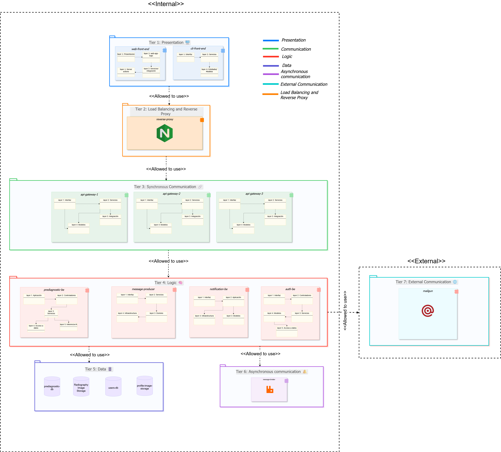
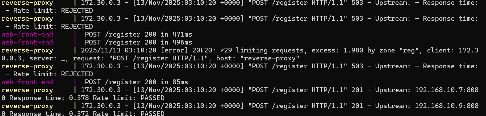

# 🚀 Delivery: Prototype 4 - AWS Deployment Architecture
**Software Architecture** | Universidad Nacional de Colombia 🎓

---

## 👥 Team 1B

| **Member** | **Email** |
|------------|-----------|
| 🔹 Edinson Sanchez Fuentes | edsanchezf@unal.edu.co |
| 🔹 Adrian Ramirez Gonzalez | adramirez@unal.edu.co |
| 🔹 Sergio Nicolas Siabatto Cleves | ssiabatto@unal.edu.co |
| 🔹 Martin Polanco Barrero | mpolancob@unal.edu.co |
| 🔹 David Fernando Adames Rondon | dadames@unal.edu.co |
| 🔹 Julian Esteban Mendoza Wilches | jmendozaw@unal.edu.co |

## NeumoDiagnostics

---

## 🩺 Software System: **NeumoDiagnostics**

### 📋 Overview
**NeumoDiagnostics** is an AI-powered support platform designed to assist doctors in reviewing patient radiographs for pneumonia detection. Our system integrates advanced machine learning with comprehensive patient management features.

> ⚠️ **Important Note**: This model is designed to support, not replace, medical judgment. The final diagnosis always remains with the healthcare professional.

---

## 🏗️ **Architectural Structures**

Our NeumoDiagnostics system employs multiple architectural views to ensure comprehensive documentation and understanding of the system's design. Each view provides unique insights into different aspects of the architecture.

---

### 🔗 **Component and Connector (C&C) Structure**

#### 📊 **C&C View**
*Visual representation of system components and their interconnections in AWS cloud environment*

#### **🎯 Description of Architectural Elements and Relations:**
This view describes runtime components, the interfaces they provide/require, and the connectors between them. It focuses on communication paths and protocols rather than implementation internals.

### User Interfaces
- **Web Browser**: Web-based user interface for accessing the system through graphical interface.
  - Connectors: HTTP to `Public ALB`.
- **CLI** (Command Line): Terminal-based interface for system access via command-line tools.
  - Connectors: HTTP to `Public ALB`.

### Load Balancer and Security Layer
- **Public ALB** (AWS Application Load Balancer): Internet-facing load balancer. Single entry point for all external requests.
  - Provided interfaces: HTTP endpoints.
  - Required connectors: HTTP to `web-frontend` (path `/*`), HTTP to `api-gateway` (paths `/graphql`, `/register`, `/login`, `/validation`, `/upload`).
  - Functions: Path-based routing, health checks, target group management, removal from service for unhealthy instances.
- **Internal ALB**: Internal load balancer for service-to-service communication.
  - Provided interfaces: HTTP endpoints (VPC only).
  - Required connectors: HTTP to `api-gateway` for Server-Side Rendering calls.

### Clients
- **web-frontend** (Next.js on ECS Fargate): UI for doctors and patients with Server-Side Rendering.
  - Connectors: HTTP to `Internal ALB` for Server Actions (authentication, data fetching).
- **cli-front-end** (Rust): Command-line client as a secondary interface (runs locally on user's machine).
  - Connectors: HTTP to `Public ALB`.

### Gateway and Orchestration
- **api-gateway** (Go on ECS Fargate): Single entry point for backend services, request validation, composition, and orchestration. Implements Hot Spare pattern via ALB health checks.
  - Provided interfaces: `/graphql` (GraphQL), `/register`, `/login`, `/validation`, `/upload` (REST).
  - Required connectors: HTTP to `auth-be`, `prediagnostic-be`, and `message-producer` via Cloud Map DNS.

### Backend Services
- **auth-be** (Go on ECS Fargate): Identity and session services.
  - Provided: REST endpoints for login, logout, registration, token validation, profile image upload.
  - Required connectors: PostgreSQL driver to `RDS auth-db`; S3 driver to `Profile Image Storage`.
- **prediagnostic-be** (Python on ECS Fargate): Imaging and (pre)diagnostic workflows. Implements Cluster N+1 pattern with 2 replicas.
  - Provided: REST endpoints for radiograph upload, ML prediction, case queries, and diagnosis registration.
  - Required connectors: MongoDB driver to `mongodb`; S3 driver to `Radiography Image Storage`.
- **message-producer** (Go on ECS Fargate): Publishes domain messages to queue.
  - Provided: REST endpoint used by `api-gateway` to request a notification.
  - Required connectors: AMQP to `rabbitmq`.
- **notification-be** (Python on ECS Fargate): Asynchronous notifications consumer (worker pattern).
  - Provided: Background consumer (no HTTP interface).
  - Required connectors: AMQP subscription to `rabbitmq`; SMTP to external email provider.

### Data Stores
- **RDS PostgreSQL** (`auth-db`): Managed relational database for identity store. Accessed only by `auth-be` via PostgreSQL driver. Pattern: Database Failover Ready (Multi-AZ capable).
- **MongoDB** (ECS Fargate): NoSQL database for clinical documents. Accessed only by `prediagnostic-be` via MongoDB driver.
- **RabbitMQ** (ECS Fargate): Message broker implementing Broker Pattern. Decouples `message-producer` from `notification-be` via queues.
- **S3 Buckets**: Object storage for `Radiography Image Storage` and `Profile Image Storage`.

### Connector Summary and Directionality
- **HTTP (External)**: `Web Browser / CLI → Public ALB`
- **HTTP (Path Routing)**: `Public ALB → web-frontend (/*)`; `Public ALB → api-gateway (/graphql, /register, /login, /upload)`
- **HTTP (Internal SSR)**: `web-frontend → Internal ALB → api-gateway`
- **HTTP (Service Mesh)**: `api-gateway → auth-be | prediagnostic-be | message-producer` (via Cloud Map DNS)
- **AMQP**: `message-producer → rabbitmq → notification-be`
- **SMTP**: `notification-be → External Email Provider`
- **PostgreSQL Driver**: `auth-be → RDS auth-db`
- **MongoDB Driver**: `prediagnostic-be → mongodb`
- **S3 Driver**: `prediagnostic-be → Radiography Storage`; `auth-be → Profile Storage`

---
#### **🏛️ Description of Architectural Styles and Patterns Used:**

- **Client–Server:** Web browsers and CLI act as clients connecting to the system through the Public ALB.
- **Load Balancer Pattern:** AWS ALB distributes requests to `api-gateway` and `web-frontend` instances using path-based routing and health checks for high availability.
- **API Gateway Pattern:** `api-gateway` exposes a unified surface for multiple backends (GraphQL + REST), orchestrates calls to downstream services, and isolates internal service topology from clients.
- **Layered Style (tiers):** Presentation (`web-frontend`, CLI), Load Balancing/Routing (ALBs), Communication (`api-gateway`), Logic (`auth-be`, `prediagnostic-be`, `message-producer`, `notification-be`), Data (RDS, MongoDB, S3), and Asynchronous (RabbitMQ). Connectors respect top-down usage between adjacent tiers.
- **Service-Based:** `auth-be`, `prediagnostic-be`, `notification-be`, and `message-producer` are independently deployable services with well-defined REST interfaces and separate data stores.
- **Broker Pattern (mediated messaging):** `message-producer` publishes messages to `rabbitmq`; `notification-be` consumes asynchronously. The broker decouples producers from consumers and enables retry mechanisms.
- **Service Discovery Pattern:** AWS Cloud Map provides DNS-based discovery (`*.neumo.internal`), allowing services to locate each other dynamically without hardcoded IPs.
- **GraphQL for client composition:** `web-frontend` queries only required fields via `/graphql` to avoid over-/under-fetching.
- **REST for transactional and internal calls:** Stable contracts for authentication, uploads, predictions, and inter-service communication.
- **Externalized services via adapters:** S3 drivers for image storage and SMTP integration with external email providers decouple infrastructure concerns from core business logic.
- **Security patterns:** JWT-based session propagation at the gateway; downstream authorization checks in services via REST/GraphQL middleware; network isolation via private subnets and Security Groups.

**Evolution from Docker Compose to AWS ECS:**
| Original (Docker Compose) | Current (AWS ECS) |
|---------------------------|-------------------|
| NginX Reverse Proxy (SSL termination, load balancing) | AWS ALB (path-based routing, health checks, managed SSL-ready) |
| Weighted Round-Robin in NginX config | ALB Target Groups with health-based routing |
| Static Docker network | VPC with public/private subnets + Cloud Map DNS |
| Single-host deployment | Multi-AZ Fargate (serverless containers) |
| Manual container management | ECS auto-scaling and task replacement |

---

### 🚀 **Deployment Structure**

#### 🌐 **Deployment View**
*AWS cloud infrastructure and deployment configuration*

#### **🎯 Description of Architectural Elements and Relations:**

| Element | Description | Relationships |
|---------|-------------|---------------|
| **VPC** | Isolated virtual network (10.0.0.0/16) containing all infrastructure | Contains all subnets, services, and databases |
| **Public Subnets** | 2 subnets (10.0.1.0/24, 10.0.2.0/24) with Internet access | Host public ALB and NAT Gateway |
| **Private Subnets** | 2 subnets (10.0.10.0/24, 10.0.20.0/24) without direct Internet access | Host all ECS services and RDS |
| **NAT Gateway** | Allows private services to access Internet (e.g., pull images) | Connects private subnets → Internet |
| **Public ALB** | Load balancer receiving Internet traffic and distributing it | Routes to web-frontend and api-gateway by path |
| **Internal ALB** | Load balancer for internal service-to-service communication | web-frontend → api-gateway (Server Actions) |

### Application Services (ECS Fargate)

| Service | Port | Description | Relationships |
|---------|------|-------------|---------------|
| **web-frontend** | 3000 | Next.js UI with SSR | → api-gateway (Server Actions) |
| **api-gateway** | 8080 | GraphQL/REST, backend entry point | → auth-be, prediagnostic-be, message-producer |
| **auth-be** | 8081 | Authentication and user management | → RDS PostgreSQL |
| **prediagnostic-be** | 8000 | ML model for pneumonia diagnosis (2 replicas) | → MongoDB, S3 |
| **message-producer** | 8082 | Publishes events to message queue | → RabbitMQ |
| **notification-be** | 8003 | Worker that consumes queue and sends notifications | ← RabbitMQ (consumes) |

### Data Services

| Service | Port | Description | Relationships |
|---------|------|-------------|---------------|
| **MongoDB** | 27017 | NoSQL database for diagnostics and images | ← prediagnostic-be |
| **RabbitMQ** | 5672 | Message broker for async communication | ← message-producer, → notification-be |
| **RDS PostgreSQL** | 5432 | Relational database for users/auth | ← auth-be |

### Service Discovery (AWS Cloud Map)

All services register in the `neumo.internal` namespace, enabling dynamic discovery via internal DNS (e.g., `auth-be.neumo.internal:8081`).

---

#### **🏛️ Description of Architectural Patterns Used:**

- **API Gateway Pattern**: `api-gateway` is the single ingress point for synchronous traffic (REST/GraphQL), isolating internal service topology from clients.
- **Broker Pattern**: Asynchronous integration via RabbitMQ decouples producers (`message-producer`) from consumers (`notification-be`).

- **Service Discovery Pattern**: AWS Cloud Map provides dynamic DNS-based service discovery, allowing services to locate each other without hardcoded IPs.

- **Hot Spare (Redundant Spare)**: `api-gateway` runs behind ALB with health checks; failed instances are automatically replaced by ECS without downtime.
- **Cluster Pattern (N+1)**: `prediagnostic-be` runs 2 replicas across availability zones for fault tolerance - if one fails, the other continues serving.
- **Load Balancer + Removal from Service**: ALB performs health checks and automatically removes unhealthy targets from rotation, enabling zero-downtime deployments.
- **Database Failover Ready**: RDS PostgreSQL is configured for easy Multi-AZ promotion in production environments.

---

### 📚 **Layered Structure**

#### 🎂 **Layered View**
*Seven-tier layered architecture with AWS services*

#### **🎯 Description of Architectural Elements and Relations:**

Our system is structured in **seven distinct layers** (tiers), each with specific responsibilities:

**Layer 1: Presentation**
- **Purpose**: User interface and interaction
- **Components**: 
  - Web Front-end (Next.js) - ECS Fargate
  - Mobile App (future)
  - External System Clients
- **Relations**: Sends requests to Layer 2 (Load Balancing)

**Layer 2: Load Balancing and Security Gateway**
- **Purpose**: Traffic distribution, SSL termination, security filtering
- **Components**:
  - Application Load Balancer (ALB)
  - AWS WAF (Web Application Firewall)
  - Route 53 (DNS)
  - CloudFront (CDN - optional)
- **Relations**: 
  - Receives requests from Layer 1
  - Distributes to Layer 3 (API Gateway)
  - Enforces security policies

**Layer 3: Synchronous Orchestration**
- **Purpose**: Request routing, composition, authentication
- **Components**:
  - API Gateway [3-9 instances] (Go) - ECS Fargate
  - AWS Cloud Map (Service Discovery)
- **Relations**:
  - Receives requests from Layer 2
  - Routes to Layer 4 (Logic services)
  - Queries service registry for backend locations

**Layer 4: Logic (Business Services)**
- **Purpose**: Core business logic and functionality
- **Components**:
  - auth-be (Go) - ECS Fargate
  - prediagnostic-be (Python) - ECS Fargate
  - message-producer (Go) - ECS Fargate
  - notification-be (Go) - ECS Fargate
- **Relations**:
  - Processes requests from Layer 3
  - Accesses Layer 6 (Data) exclusively
  - Publishes events to Layer 5 (Asynchronous Communication)

**Layer 5: Asynchronous Communication**
- **Purpose**: Non-blocking message handling
- **Components**:
  - Amazon MQ (RabbitMQ) - Multi-AZ cluster
- **Relations**:
  - Receives messages from message-producer (Layer 4)
  - Delivers messages to notification-be (Layer 4)
  - Enables decoupled communication

**Layer 6: Data**
- **Purpose**: Data persistence and retrieval
- **Components**:
  - RDS PostgreSQL (Multi-AZ) - auth data
  - DocumentDB (Cluster) - clinical data
  - Amazon S3 - images and files
    - neumo-radiography-images
    - neumo-profile-images
    - neumo-backup-data
- **Relations**:
  - Accessed exclusively by Layer 4 services
  - Provides ACID transactions (RDS, DocumentDB)
  - Provides object storage (S3)

**Layer 7: External Communication**
- **Purpose**: Integration with external services
- **Components**:
  - Amazon SES (Email service)
  - External Healthcare Systems (via API)
  - Third-party Services
- **Relations**:
  - Invoked by Layer 4 (notification-be)
  - Extends system capabilities

**Layer Communication Rules:**
- Each layer can only communicate with adjacent layers (strict layering)
- Upper layers depend on lower layers
- Lower layers are unaware of upper layers
- Cross-layer communication prohibited (enforced by security groups)

#### **🏛️ Description of Architectural Patterns Used:**

- **7-Tier Layered Pattern**: Strict hierarchical organization
- **API Gateway Pattern**: Layer 3 orchestrates backend services
- **Load Balancer Pattern**: Layer 2 distributes traffic
- **Broker Pattern**: Layer 5 enables asynchronous messaging
- **Repository Pattern**: Layer 6 abstracts data access
- **Service Layer Pattern**: Layer 4 encapsulates business logic

**AWS Service Mapping:**
- **Layer 2**: AWS managed services (ALB, WAF, Route 53)
- **Layers 3-4**: ECS Fargate (serverless containers)
- **Layer 5**: Amazon MQ (managed message broker)
- **Layer 6**: Managed databases (RDS, DocumentDB) + S3
- **Layer 7**: AWS SES + external APIs

---

### 🧩 **Decomposition Structure**

#### 🔍 **Decomposition View**
*System breakdown into modules and functionalities*

#### **🎯 Description of Architectural Elements and Relations:**

This view decomposes the system into implementation units (modules and submodules) showing "is part of" relationships.

**Authentication Module** (implemented in `auth-be` ECS service)
- **Session Management** (submodule)
  - F1: Sign in
  - F2: Sign out
- **User Management** (submodule)
  - F3: Register user
  - F4: Upload profile picture

**Cases Management Module** (implemented in `prediagnostic-be` ECS service)
- **Query Management** (submodule)
  - F5: List pending cases
  - F6: List cases by patient
  - F7: List case by ID
- **Diagnostic Management** (submodule)
  - F8: Register medical diagnosis

**Prediagnostic Management Module** (implemented in `prediagnostic-be` ECS service)
- **Radiograph Management** (submodule)
  - F9: Upload radiograph
- **Prediagnostic Registration** (submodule)
  - F10: Register prediagnostic (AI prediction)

**Notifications Management Module** (implemented in `notification-be` ECS service)
- F11: Send email notifications

**Module-to-Service Mapping:**
- Authentication Module → `auth-be` ECS service → RDS PostgreSQL + S3 (profile images)
- Cases Management Module → `prediagnostic-be` ECS service → DocumentDB
- Prediagnostic Management Module → `prediagnostic-be` ECS service → DocumentDB + S3 (radiography images)
- Notifications Management Module → `notification-be` ECS service → Amazon SES

**Rationale for Module Organization:**
- Modules grouped by domain responsibility (authentication, diagnostics, notifications)
- Each module maps to one or more microservices
- Submodules represent cohesive functionality groups
- Facilitates parallel development and independent deployment

---

## 🎯 **Quality Attributes**

### **Security**

All security scenarios from Prototype 3 are maintained and enhanced:

## 🎯 **Quality Attributes**

### 🔒 **Security**

#### **Security Scenarios**

Our system implements four critical security scenarios to ensure data protection, user authentication, and secure communications:

##### **Scenario 1: Network Segmentation**

**Description:**
- **Source (Fuente):** Person using their own computer
- **Stimulus (Estímulo):** Direct request sent to some component of the private network (Back-end and databases)
- **Artifact (Artefacto):** Private network components (Back-end and databases)
- **Environment (Ambiente):** System during its normal execution
- **Response (Respuesta):** Request rejection
- **Response Measure (Medición de la respuesta):** Number of requests made to private network components that have been rejected

**Applied Pattern:** Network Segmentation Pattern

---

##### **Scenario 2: Reverse Proxy**

**Description:**
- **Source (Fuente):** External attacker or poorly maintained client
- **Stimulus (Estímulo):** Multiple malicious requests attempting to access backend services and overload the API Gateway
- **Artifact (Artefacto):** NginX configured as the single entry point
- **Environment (Ambiente):** System during its normal execution
- **Response (Respuesta):** The reverse proxy intercepts and blocks unauthorized access, filters and detects each request
- **Response Measure (Medición de la respuesta):** The reverse proxy registers and rejects illegitimate access, maintains and protects healthy instances

**Applied Pattern:** Reverse Proxy Pattern

---

##### **Scenario 3: Token Authentication (JWT)**

**Description:**
- **Source (Fuente):** Malicious user without valid identification in the system
- **Stimulus (Estímulo):** Attempt to use any system functionality different from login or register
- **Artifact (Artefacto):** Set of functionalities that require authentication and a specific role (doctor or patient)
- **Environment (Ambiente):** System during its normal execution
- **Response (Respuesta):** Rejection of the request and redirection of the user to the login service or to their corresponding dashboard in case a lack of a valid JWT token identifying the user is detected
- **Response Measure (Medición de la respuesta):** Number of requests rejected due to missing valid JWT token

**Improves from Prototype 3:** There was a big vulnerability related to this pattern because somebody could steal the JWT from any user and use it in any other PC. To correct this vulnerability, now our JWT stores the ip of the user whe he logs in, and, when the user wants to send a request, the authentication system verifies if the JWT's ip is the same as the ip that is sending the request. If it is not, ther user is redirected to the login service.

**Applied Pattern:** Token-Based Authentication (JWT)

---

##### **Scenario 4: Secure Channel (HTTPS/TLS)**

**Description:**
- **Source (Fuente):** User with bad intentions
- **Stimulus (Estímulo):** Attempt to intercept, read, or modify information transmitted between client and server during normal system communication
- **Artifact (Artefacto):** Secure communication channel implemented with HTTPS/TLS between client and reverse proxy
- **Environment (Ambiente):** System during its normal operation
- **Response (Respuesta):** Protection of communication through TLS encryption and rejection of any interception or data manipulation attempts
- **Response Measure (Medición de la respuesta):** Interception attempts blocked and traffic completely encrypted

**Applied Pattern:** Secure Channel Pattern (HTTPS/TLS)

---

#### **Applied Architectural Tactics**

Our system implements multiple security tactics organized by their defensive objectives:

##### **Resist Attacks**

- **Authenticate Actor:** JWT-based authentication system validates user identity before granting access to protected resources. Implemented in `auth-be` service with token validation at the API Gateway level.

- **Authorize Actors:** Role-based authorization checks ensure users can only access functionalities appropriate to their roles (doctors vs. patients). Enforced through middleware in the API Gateway and backend services.

- **Limit Access:** Network segmentation isolates private components (backend services and databases) from direct external access. Only the API Gateway is exposed as the single entry point.

- **Limit Exposure:** The API Gateway pattern minimizes the attack surface by exposing only necessary endpoints and hiding internal service topology from external clients.

- **Encrypt Data:** TLS/HTTPS encryption protects all data in transit between clients and the reverse proxy, and between internal services when handling sensitive information.

- **Separate Entities:** Microservices architecture separates concerns into independent services (`auth-be`, `prediagnostic-be`, `notification-be`), limiting the blast radius of potential security breaches.

##### **React to Attacks**

- **Revoke Access:** System can redirect the user to the service login to make him generate a new JWT, if the current JWT is invalid

---

#### **Applied Architectural Patterns**

- **Network Segmentation Pattern:** Isolation of private network components from direct external access
- **Reverse Proxy Pattern:** NginX as single entry point for filtering, load balancing, and security enforcement
- **Token-Based Authentication Pattern:** JWT for secure session management and stateless authentication
- **Secure Channel Pattern:** HTTPS/TLS encryption for all client-server communications

---

### **Performance and Scalability**

#### **Performance Scenarios**

Our system implements performance and scalability scenarios to ensure optimal resource utilization and response times under varying load conditions:

### **Scenario 1: Load Balancer / Weighted Round-Robin**

**📋 Description:**
- **Source (Fuente):** 300 users
- **Stimulus (Estímulo):** Sending 300 different requests in 1 second
- **Artifact (Artefacto):** System
- **Environment (Ambiente):** System during its normal execution
- **Response (Respuesta):** Distribution of requests among the 3 API Gateway instances according to the Weighted Round-Robin algorithm
- **Response Measure (Medición de la respuesta):** Number of requests handled by each API Gateway instance

**Applied Pattern:** Load Balancer

### **Scenario 2: Throttling**

**📋 Description:**
- **Source (Fuente):** One or several users or a botnet.
- **Stimulus (Estímulo):** Sending more than 20 requests per minute from the same user.
- **Artifact (Artefacto):** System
- **Environment (Ambiente):** System during its normal execution
- **Response (Respuesta):** Limit the number of requests per minute from the same source establishing a rate limit through an intermediary (nginx)

- **Response Measure (Medición de la respuesta):** The number of requests accepted and rejected from the implied service.

**Applied Pattern:** **Throttling***: This pattern is used to limit access to some important resource or service. We can gracefully handle variations in demand.

We implemented this pattern through ***nginx*** setting the rate limit in the services we wanted. Next we can see an example about the implementation of this pattern. We are going to set a rate limit of 10 requests per minute with a burst of 1 to the register service exposed by the auth-be component. This means that our system will admit just 1 request each 6 seconds.

In order to make this scenario, we are going to do 5 requests in one second through *JMeter* and then we are going to see the logs.

As we can see, only 2 of 5 requests were accepted. The reason to accept 2 of 5 is that we set a burst of 1, this means we have one more "emergency" request.

---

#### **Applied Architectural Tactics**

Our system implements performance tactics to optimize resource utilization and response times:

**Control Resource Demand**

- **Manage Work Requests:** The system processes incoming requests efficiently through the load balancer, distributing workload across multiple instances.

**Manage Resources**

- **Increase Resources:** Multiple API Gateway instances (3 instances) are deployed to handle increased load and provide redundancy.
- **Introduce Concurrency:** The Weighted Round-Robin algorithm distributes requests across multiple instances, enabling parallel processing of requests.
- **Maintain Multiple Copies of Computations:** Three instances of the API Gateway run simultaneously to handle concurrent requests without blocking.
- **Schedule Resources:** Weighted Round-Robin scheduling algorithm manages how requests are distributed among available API Gateway instances based on their weights and current load.

---

#### **Applied Architectural Patterns**

- **Load Balancer Pattern:** Weighted Round-Robin algorithm distributes incoming requests across multiple API Gateway instances

---

## **Reliability**

Our architecture implements multiple reliability patterns to ensure high availability, resilience, and fault tolerance across all system components.

### **Reliability Scenarios**

##### **Scenario 1: Replication Pattern (Hot Spare)**

**Description:**
- **Source (Fuente):** User (doctor or patient)
- **Stimulus (Estímulo):** User sends a request which implies to make an action on the database auth-db
- **Artifact (Artefacto):** The system
- **Environment (Ambiente):** System with a failure on the database auth-db
- **Response (Respuesta):** The hot spare database is used to keep the system working
- **Response Measure (Medición de la respuesta):** Number of failed requests sent to the database 

**Applied Pattern:** Replication Pattern (Hot Spare)

##### **Scenario 2: Cluster Pattern**

**Description:**
- **Source (Fuente):** Patient using the system from his PC
- **Stimulus (Estímulo):** User enters to his dashboard to se his radiographies and their states
- **Artifact (Artefacto):** The system
- **Environment (Ambiente):** System during the normal execution
- **Response (Respuesta):** The MongoDB cluster filters the radipgraphies by user's id and returns the information to visualize it in the front end
- **Response Measure (Medición de la respuesta):** Percentage of correctly returned cases

**Applied Pattern:** 

##### **Scenario 3: Load Balancer with Removal From Service Tactic implementend**

.png)

**Description:**
- **Source (Fuente):** User (doctor or patient)
- **Stimulus (Estímulo):** User sends a request
- **Artifact (Artefacto):** The system
- **Environment (Ambiente):** System with failes in one of the API Gateway instances
- **Response (Respuesta):**  The load balancer detects the failures in one of the instances and discards it for the next requests
- **Response Measure (Medición de la respuesta):** Number of requests without processing due to the failure in the instance of the API Gateway

**Applied Pattern:** Load Balancer

##### **Scenario 4: Service Discovery Pattern**

**Description:**
- **Source (Fuente):** User (doctor or patient)
- **Stimulus (Estímulo):** User sends a request
- **Artifact (Artefacto):** The system
- **Environment (Ambiente):** The system during normal execution
- **Response (Respuesta):** The system detects all the available API Gateway instances to allow the load balancer to choose the instance that is going to process the request
- **Response Measure (Medición de la respuesta):** Number of requests that each instance has processed

**Applied Pattern:** Service Discovery Pattern

#### **Applied Architectural Tactics**

- **Redundant Spare**
- **Removal from service**

### **Interoperability Scenario**

##### **Scenario 1: Interoperability**

**Description:**
- **Source (Fuente):** Doctor using web-front-end
- **Stimulus (Estímulo):** The doctor makes a diagnostic for one of the cases
- **Artifact (Artefacto):**  The system
- **Environment (Ambiente):**  System during normal execution
- **Response (Respuesta):** The API GAteway coordinates the communication between different components (auth-be, prediagnostic-be, message_producer, etc.) to generate a response to the user
- **Response Measure (Medición de la respuesta):** Percentaje of requests fulfilled