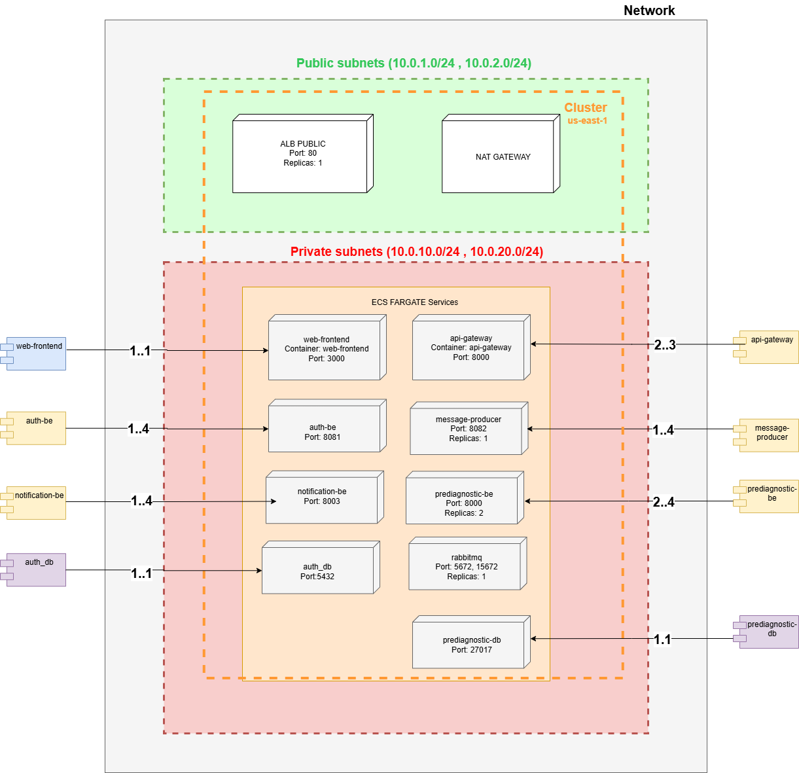
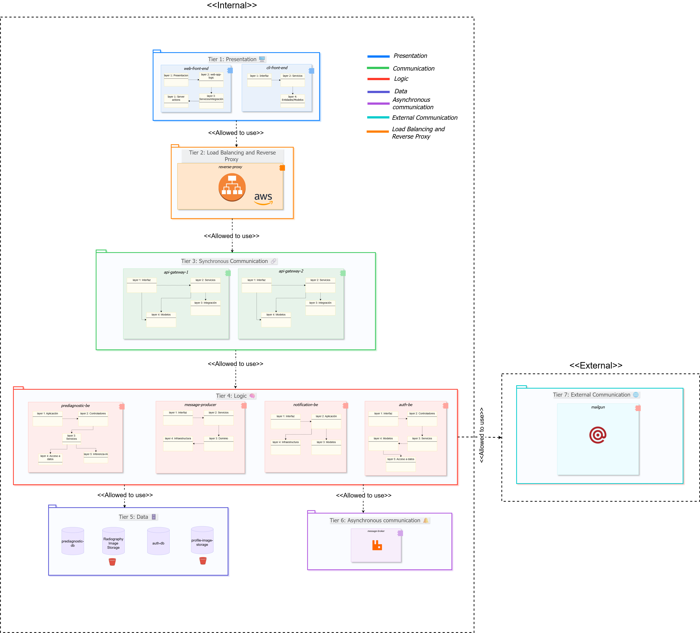
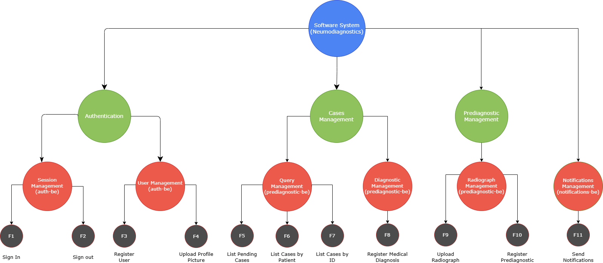
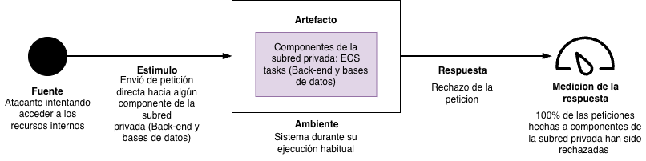
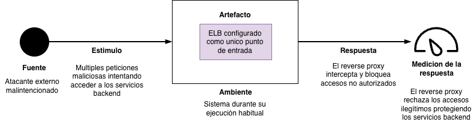
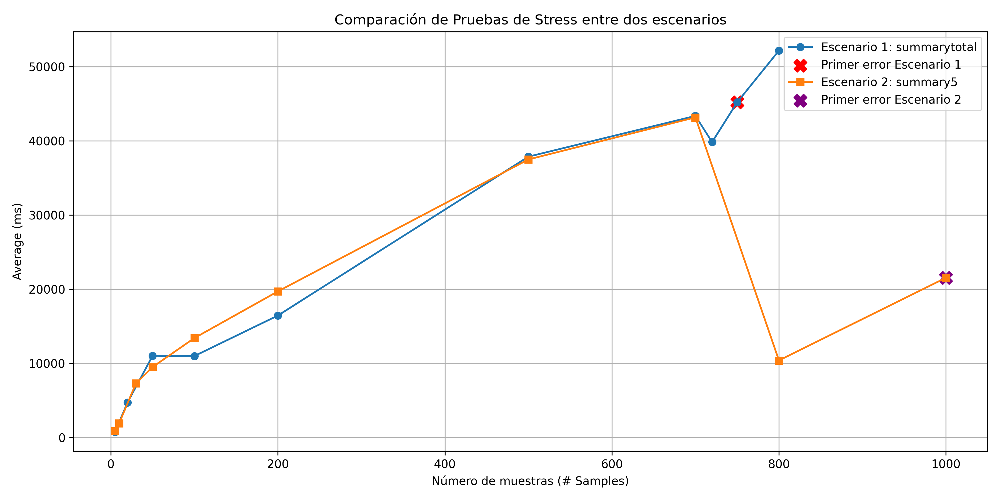
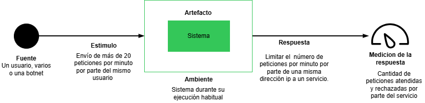
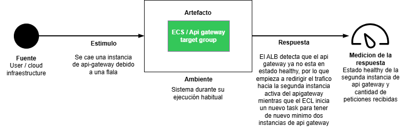
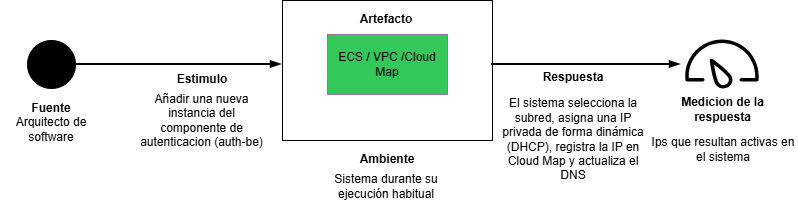

# 🚀 Delivery: Prototype 4 - AWS Deployment Architecture
**Software Architecture** | Universidad Nacional de Colombia 🎓

---

## 👥 Team 1B

| **Member** | **Email** |
|------------|-----------|
| 🔹 Adrian Ramirez Gonzalez | adramirez@unal.edu.co |
| 🔹 Sergio Nicolas Siabatto Cleves | ssiabatto@unal.edu.co |
| 🔹 Martin Polanco Barrero | mpolancob@unal.edu.co |
| 🔹 David Fernando Adames Rondon | dadames@unal.edu.co |
| 🔹 Julian Esteban Mendoza Wilches | jmendozaw@unal.edu.co |

## NeumoDiagnostics

---

## 🩺 Software System: **NeumoDiagnostics**

### 📋 Overview
**NeumoDiagnostics** is an AI-powered support platform designed to assist doctors in reviewing patient radiographs for pneumonia detection. Our system integrates advanced machine learning with comprehensive patient management features.

> ⚠️ **Important Note**: This model is designed to support, not replace, medical judgment. The final diagnosis always remains with the healthcare professional.

---

## 🏗️ **Architectural Structures**

Our NeumoDiagnostics system employs multiple architectural views to ensure comprehensive documentation and understanding of the system's design. Each view provides unique insights into different aspects of the architecture.

---

### 🔗 **Component and Connector (C&C) Structure**

#### 📊 **C&C View**
*Visual representation of system components and their interconnections in AWS cloud environment*

#### **🎯 Description of Architectural Elements and Relations:**
This view describes runtime components, the interfaces they provide/require, and the connectors between them. It focuses on communication paths and protocols rather than implementation internals.

### User Interfaces
- **Web Browser**: Web-based user interface for accessing the system through graphical interface.
  - Connectors: HTTP to `Public ALB`.
- **CLI** (Command Line): Terminal-based interface for system access via command-line tools.
  - Connectors: HTTP to `Public ALB`.

### Load Balancer and Security Layer
- **Public ALB** (AWS Application Load Balancer): Internet-facing load balancer. Single entry point for all external requests.
  - Provided interfaces: HTTP endpoints.
  - Required connectors: HTTP to `web-frontend` (path `/*`), HTTP to `api-gateway` (paths `/graphql`, `/register`, `/login`, `/validation`, `/upload`).
  - Functions: Path-based routing, health checks, target group management, removal from service for unhealthy instances.
- **Internal ALB**: Internal load balancer for service-to-service communication.
  - Provided interfaces: HTTP endpoints (VPC only).
  - Required connectors: HTTP to `api-gateway` for Server-Side Rendering calls.

### Clients
- **web-frontend** (Next.js on ECS Fargate): UI for doctors and patients with Server-Side Rendering.
  - Connectors: HTTP to `Internal ALB` for Server Actions (authentication, data fetching).
- **cli-front-end** (Rust): Command-line client as a secondary interface (runs locally on user's machine).
  - Connectors: HTTP to `Public ALB`.

### Gateway and Orchestration
- **api-gateway** (Go on ECS Fargate): Single entry point for backend services, request validation, composition, and orchestration. Implements Hot Spare pattern via ALB health checks.
  - Provided interfaces: `/graphql` (GraphQL), `/register`, `/login`, `/validation`, `/upload` (REST).
  - Required connectors: HTTP to `auth-be`, `prediagnostic-be`, and `message-producer` via Cloud Map DNS.

### Backend Services
- **auth-be** (Go on ECS Fargate): Identity and session services.
  - Provided: REST endpoints for login, logout, registration, token validation, profile image upload.
  - Required connectors: PostgreSQL driver to `RDS auth-db`; S3 driver to `Profile Image Storage`.
- **prediagnostic-be** (Python on ECS Fargate): Imaging and (pre)diagnostic workflows. Implements Cluster N+1 pattern with 2 replicas.
  - Provided: REST endpoints for radiograph upload, ML prediction, case queries, and diagnosis registration.
  - Required connectors: MongoDB driver to `mongodb`; S3 driver to `Radiography Image Storage`.
- **message-producer** (Go on ECS Fargate): Publishes domain messages to queue.
  - Provided: REST endpoint used by `api-gateway` to request a notification.
  - Required connectors: AMQP to `rabbitmq`.
- **notification-be** (Python on ECS Fargate): Asynchronous notifications consumer (worker pattern).
  - Provided: Background consumer (no HTTP interface).
  - Required connectors: AMQP subscription to `rabbitmq`; SMTP to external email provider.

### Data Stores
- **Auth-db** (`auth-db`): Managed relational database for identity store. Accessed only by `auth-be` via PostgreSQL driver. Pattern: Database Failover Ready (Multi-AZ capable).
- **prediagnostic-db** (ECS Fargate): NoSQL database for clinical documents. Accessed only by `prediagnostic-be` via MongoDB driver.
- **RabbitMQ** (ECS Fargate): Message broker implementing Broker Pattern. Decouples `message-producer` from `notification-be` via queues.
- **S3 Buckets**: Object storage for `Radiography Image Storage` and `Profile Image Storage`.

### Connector Summary and Directionality
- **HTTP (External)**: `Web Browser / CLI → Public ALB`
- **HTTP (Path Routing)**: `Public ALB → web-frontend (/*)`; `Public ALB → api-gateway (/graphql, /register, /login, /upload)`
- **HTTP (Internal SSR)**: `web-frontend → Internal ALB → api-gateway`
- **HTTP (Service Mesh)**: `api-gateway → auth-be | prediagnostic-be | message-producer` (via Cloud Map DNS)
- **AMQP**: `message-producer → rabbitmq → notification-be`
- **SMTP**: `notification-be → External Email Provider`
- **PostgreSQL Driver**: `auth-be → RDS auth-db`
- **MongoDB Driver**: `prediagnostic-be → mongodb`
- **S3 Driver**: `prediagnostic-be → Radiography Storage`; `auth-be → Profile Storage`

---
#### **🏛️ Description of Architectural Styles and Patterns Used:**

- **Client–Server:** Web browsers and CLI act as clients connecting to the system through the Public ALB.
- **Load Balancer Pattern:** AWS ALB distributes requests to `api-gateway` and `web-frontend` instances using path-based routing and health checks for high availability.
- **API Gateway Pattern:** `api-gateway` exposes a unified surface for multiple backends (GraphQL + REST), orchestrates calls to downstream services, and isolates internal service topology from clients.
- **Service-Based:** `auth-be`, `prediagnostic-be`, `notification-be`, and `message-producer` are independently deployable services with well-defined REST interfaces and separate data stores.
- **Broker Pattern (mediated messaging):** `message-producer` publishes messages to `rabbitmq`; `notification-be` consumes asynchronously. The broker decouples producers from consumers and enables retry mechanisms.
- **Service Discovery Pattern:** AWS Cloud Map provides DNS-based discovery (`*.neumo.internal`), allowing services to locate each other dynamically without hardcoded IPs.
- **GraphQL for client composition:** `web-frontend` queries only required fields via `/graphql` to avoid over-/under-fetching.
- **REST for transactional and internal calls:** Stable contracts for authentication, uploads, predictions, and inter-service communication.
- **Externalized services via adapters:** S3 drivers for image storage and SMTP integration with external email providers decouple infrastructure concerns from core business logic.
- **Security patterns:** JWT-based session propagation at the gateway; downstream authorization checks in services via REST/GraphQL middleware; network isolation via private subnets and Security Groups.

**Evolution from Docker Compose to AWS ECS:**
| Original (Docker Compose) | Current (AWS ECS) |
|---------------------------|-------------------|
| NginX Reverse Proxy (SSL termination, load balancing) | AWS ALB (path-based routing, health checks, managed SSL-ready) |
| Weighted Round-Robin in NginX config | ALB Target Groups with health-based routing |
| Static Docker network | VPC with public/private subnets + Cloud Map DNS |
| Single-host deployment | Multi-AZ Fargate (serverless containers) |
| Manual container management | ECS auto-scaling and task replacement |

---

### 🚀 **Deployment Structure**

#### 🌐 **Deployment View**
*AWS cloud infrastructure and deployment configuration*

#### **🎯 Description of Architectural Elements and Relations:**

| Element | Description | Relationships |
|---------|-------------|---------------|
| **VPC** | Isolated virtual network (10.0.0.0/16) containing all infrastructure | Contains all subnets, services, and databases |
| **Public Subnets** | 2 subnets (10.0.1.0/24, 10.0.2.0/24) with Internet access | Host public ALB and NAT Gateway |
| **Private Subnets** | 2 subnets (10.0.10.0/24, 10.0.20.0/24) without direct Internet access | Host all ECS services and RDS |
| **NAT Gateway** | Allows private services to access Internet (e.g., pull images) | Connects private subnets → Internet |
| **Public ALB** | Load balancer receiving Internet traffic and distributing it | Routes to web-frontend and api-gateway by path |

### Application Services (ECS Fargate)

| Service | Port | Description | Min Replicas | Max Replicas | Relationships |
|---------|------|-------------|--------------|--------------|---------------|
| **web-frontend** | 3000 | Next.js UI with SSR | 1 | 1 | → api-gateway (Server Actions) |
| **api-gateway** | 8080 | GraphQL/REST, backend entry point | 3 | 3 | → auth-be, prediagnostic-be, message-producer |
| **auth-be** | 8081 | Authentication and user management | 1 | 1 | → RDS PostgreSQL |
| **prediagnostic-be** | 8000 | ML model for pneumonia diagnosis | 2 | 4 | → MongoDB, S3 |
| **message-producer** | 8082 | Publishes events to message queue | 1 | 4 | → RabbitMQ |
| **notification-be** | 8003 | Worker that consumes queue and sends notifications | 1 | 4 | ← RabbitMQ (consumes) |

### Data Services

| Service | Port | Description | Min Replicas | Max Replicas | Relationships |
|---------|------|-------------|--------------|--------------|---------------|
| **prediagnostic-db** | 27017 | NoSQL database for diagnostics and images | 1 | 1 | ← prediagnostic-be |
| **message-broker** | 5672 | Message broker for async communication | 1 | 1 | ← message-producer, → notification-be |
| **auth-db** | 5432 | Relational database for users/auth | 1 | 1 | ← auth-be |

### Service Discovery (AWS Cloud Map)

All services register in the `neumo.internal` namespace, enabling dynamic discovery via internal DNS (e.g., `auth-be.neumo.internal:8081`).

---

#### **🏛️ Description of Architectural Patterns Used:**

- **API Gateway Pattern**: `api-gateway` is the single ingress point for synchronous traffic (REST/GraphQL), isolating internal service topology from clients.
- **Broker Pattern**: Asynchronous integration via RabbitMQ decouples producers (`message-producer`) from consumers (`notification-be`).

- **Service Discovery Pattern**: AWS Cloud Map provides dynamic DNS-based service discovery, allowing services to locate each other without hardcoded IPs.

- **Hot Spare (Redundant Spare)**: `api-gateway` runs behind ALB with health checks; failed instances are automatically replaced by ECS without downtime.
- **Cluster Pattern (N+1)**: `prediagnostic-be` runs 2 replicas across availability zones for fault tolerance - if one fails, the other continues serving.
- **Load Balancer + Removal from Service**: ALB performs health checks and automatically removes unhealthy targets from rotation, enabling zero-downtime deployments.
- **Database Failover Ready**: RDS PostgreSQL is configured for easy Multi-AZ promotion in production environments.

---

### 📚 **Layered Structure**

#### 🎂 **Layered View**
*Seven-tier layered architecture with AWS services*

#### **🎯 Description of Architectural Elements and Relations:**

Our NeumoDiagnostics system is structured in **seven distinct layers** (tiers), each with specific responsibilities and well-defined interactions:

🖼️ **Layer 1: Presentation**
- **Purpose**: User interface and interaction management
- **Components**: 
  - Web Front-end (Next.js on ECS Fargate)
  - CLI Front-end (Rust, runs locally on user's machine)
- **Relations**: Generates requests that are forwarded to the Load Balancing layer via HTTP

🔄 **Layer 2: Load Balancing and Routing**
- **Purpose**: Request distribution, path-based routing, and health monitoring
- **Key Components**: 
  - Public ALB (internet-facing, receives external traffic)
  - Internal ALB (VPC-only, handles SSR Server Actions)
- **Relations**: 
  - Receives all incoming requests from Presentation layer
  - Distributes requests to `web-frontend` and `api-gateway` using path-based routing
  - Performs health checks and removes unhealthy targets from rotation
  - Acts as single entry point for external traffic

🔀 **Layer 3: Synchronous Orchestration**
- **Purpose**: Real-time request routing, validation, and orchestration
- **Key Component**: API Gateway (Go on ECS Fargate)
- **Relations**: 
  - Receives load-balanced requests from ALBs
  - Routes requests to appropriate Logic layer components via Cloud Map DNS
  - Ensures synchronous communication patterns (GraphQL + REST)
  - Validates and composes requests before forwarding

⚙️ **Layer 4: Logic**
- **Purpose**: Core business logic and system functionality
- **Components**: 
  - auth-be (Go) - Authentication and user management
  - prediagnostic-be (Python) - ML-based pneumonia diagnosis
  - message-producer (Go) - Event publishing to message queue
  - notification-be (Python) - Async notification worker
- **Relations**: 
  - Processes requests from API Gateway
  - Exclusive access to system data through Data layer
  - Implements main system functionalities
  - Publishes events to Asynchronous Communication layer

📨 **Layer 5: Asynchronous Communication**
- **Purpose**: Non-blocking message handling and event-driven communication
- **Technology**: RabbitMQ (AMQP protocol, on ECS Fargate)
- **Relations**: 
  - Manages asynchronous message queues between `message-producer` and `notification-be`
  - Enables system to continue processing while messages are queued
  - Supports decoupled component communication

💾 **Layer 6: Data**
- **Purpose**: Data storage and integrity management
- **Components**: 
  - RDS PostgreSQL (`auth-db`) - User and authentication data
  - MongoDB (ECS Fargate) - Clinical documents and diagnostics
  - S3 Buckets - Radiography and profile image storage
- **Relations**: Provides persistent storage for all system data, accessed exclusively by Logic layer components

🌐 **Layer 7: External Communication**
- **Purpose**: Integration with external services
- **Services**: External Email Provider (SMTP)
- **Relations**: 
  - Extends system capabilities through external APIs
  - Handles email notifications triggered by `notification-be`

**Evolution from Docker Compose to AWS ECS:**
| Original (Docker Compose) | Current (AWS ECS) |
|---------------------------|-------------------|
| NginX Reverse Proxy (SSL termination, load balancing) | AWS ALB (path-based routing, health checks, managed SSL-ready) |
| Weighted Round-Robin in NginX config | ALB Target Groups with health-based routing |
| Static Docker network | VPC with public/private subnets + Cloud Map DNS |
| Single-host deployment | Multi-AZ Fargate (serverless containers) |
| Manual container management | ECS auto-scaling and task replacement |

---

#### **🏛️ Description of Architectural Patterns Used:**

#### 🏛️ **Description of Architectural Patterns in Layered View**

As described in the C&C view, we implemented several software architectural patterns. Here we examine them within our layered architecture for better understanding:

**7-Tier Layered Pattern**: This organizational pattern structures our system into 7 distinct layers (tiers) as described above. Each layer follows a strict hierarchical order, where upper layers can only communicate with adjacent lower layers.

**Load Balancer Pattern**: Located in Layer 2 (Load Balancing and Routing), AWS Application Load Balancers (Public and Internal) act as the entry points for external and internal traffic respectively. They provide path-based routing, health monitoring, and automatic removal of unhealthy targets before routing to backend services.

**API Gateway Pattern**: This communication pattern is located in Layer 3 (Synchronous Orchestration). The API Gateway acts as an intermediary between the load balancers and backend microservices. It handles request composition, validation, GraphQL/REST routing, and service discovery via Cloud Map DNS while following the hierarchical structure.

**Service Discovery Pattern**: Spanning Layers 3-6, AWS Cloud Map provides DNS-based service discovery (`*.neumo.internal`). Services register themselves and can locate other services dynamically without hardcoded IPs, enabling flexible inter-layer communication within the VPC.

**Broker Pattern**: This asynchronous communication pattern is located in Layer 5 (Asynchronous Communication). The message broker (RabbitMQ) decouples producers (`message-producer`) from consumers (`notification-be`) through AMQP queues. The broker itself belongs to this layer, while producers and consumers reside in the Logic layer (Layer 4).

**Evolution from Docker Compose to AWS ECS:**
| Original (Docker Compose) | Current (AWS ECS) |
|---------------------------|-------------------|
| NginX Reverse Proxy (SSL termination, load balancing) | AWS ALB (path-based routing, health checks, managed SSL-ready) |
| Weighted Round-Robin in NginX config | ALB Target Groups with health-based routing |
| Static Docker network | VPC with public/private subnets + Cloud Map DNS |
| Single-host deployment | Multi-AZ Fargate (serverless containers) |
| Manual container management | ECS auto-scaling and task replacement |

---

#### 🧠 **Logic Layers**
As you can see, there are logic layers within each component. In almost all components, we tried to build them using a Clean Architecture approach as the foundation for managing each component’s logic.

Now, we’re going to briefly explain the responsibility of each layer. This explanation will be general, since this approach is applied in almost all components.

- **Presentation Layer (UI)** 🎨  
  Handles user interaction and displays information.  
  It sends user actions to the application layer.

- **Application Layer (Services / Use Cases)** ⚙️  
  Contains the business logic that coordinates entities and defines use cases.

- **Domain Layer (Models / Entities)** 🧠  
  Holds the core business rules and entities.  
  It’s completely independent from external concerns.

- **Infrastructure Layer** 🧩  
  Implements technical details such as database access, APIs, message brokers, and external services.

> **In short:** Infrastructure *implements*, Domain *defines*, Application *coordinates*, and Presentation *interacts*.

---
### 🧩 **Decomposition Structure**

#### 🔍 **Decomposition View**
*System breakdown into modules and functionalities*

#### **🎯 Description of Architectural Elements and Relations:**

This view decomposes the system into implementation units (modules and submodules) showing "is part of" relationships.

**Authentication Module** (implemented in `auth-be` ECS service)
- **Session Management** (submodule)
  - F1: Sign in
  - F2: Sign out
- **User Management** (submodule)
  - F3: Register user
  - F4: Upload profile picture

**Cases Management Module** (implemented in `prediagnostic-be` ECS service)
- **Query Management** (submodule)
  - F5: List pending cases
  - F6: List cases by patient
  - F7: List case by ID
- **Diagnostic Management** (submodule)
  - F8: Register medical diagnosis

**Prediagnostic Management Module** (implemented in `prediagnostic-be` ECS service)
- **Radiograph Management** (submodule)
  - F9: Upload radiograph
- **Prediagnostic Registration** (submodule)
  - F10: Register prediagnostic (AI prediction)

**Notifications Management Module** (implemented in `notification-be` ECS service)
- F11: Send email notifications

**Module-to-Service Mapping:**
- Authentication Module → `auth-be` ECS service → RDS PostgreSQL + S3 (profile images)
- Cases Management Module → `prediagnostic-be` ECS service → DocumentDB
- Prediagnostic Management Module → `prediagnostic-be` ECS service → DocumentDB + S3 (radiography images)
- Notifications Management Module → `notification-be` ECS service → Amazon SES

**Rationale for Module Organization:**
- Modules grouped by domain responsibility (authentication, diagnostics, notifications)
- Each module maps to one or more microservices
- Submodules represent cohesive functionality groups
- Facilitates parallel development and independent deployment

---

## 🎯 **Quality Attributes**

### **Security**

All security scenarios from Prototype 3 are maintained and enhanced:

## 🎯 **Quality Attributes**

### 🔒 **Security**

#### **Security Scenarios**

Our system implements four critical security scenarios to ensure data protection, user authentication, and secure communications:

**Scenario 1: Network Segmentation**

**Description:**
- **Source (Fuente):** Attacker attempting to access internal resources
- **Stimulus (Estímulo):** Direct request sent to some component of the private subnet (Back-end and databases)
- **Artifact (Artefacto):** Private subnet resources: ECS tasks (Back-end and databases)
- **Environment (Ambiente):** System during its normal execution
- **Response (Respuesta):** Request rejection
- **Response Measure (Medición de la respuesta):** 100% of requests made to components of the private subnet have been rejected

**Applied Pattern:** Network Segmentation Pattern

---

**Scenario 2: Reverse Proxy**

**Description:**
- **Source (Fuente):** External attacker
- **Stimulus (Estímulo):** Multiple malicious requests attempting to access backend services
- **Artifact (Artefacto):** ELB configured as the single entry point
- **Environment (Ambiente):** System during its normal execution
- **Response (Respuesta):** The reverse proxy intercepts and blocks unauthorized access
- **Response Measure (Medición de la respuesta):** The reverse proxy rejects illegitimate access and protects backend services

**Applied Pattern:** Reverse Proxy Pattern

---

**Scenario 3: Token Authentication (JWT)**

**Description:**
- **Source (Fuente):** Malicious user without valid identification in the system
- **Stimulus (Estímulo):** Attempt to use any system functionality different from login or register
- **Artifact (Artefacto):** Set of functionalities that require authentication and a specific role (doctor or patient)
- **Environment (Ambiente):** System during its normal execution
- **Response (Respuesta):** Rejection of the request and redirection of the user to the login service or to their corresponding dashboard in case a lack of a valid JWT token identifying the user is detected
- **Response Measure (Medición de la respuesta):** Number of requests rejected due to missing valid JWT token

**Improves from Prototype 3:** There was a big vulnerability related to this pattern because somebody could steal the JWT from any user and use it in any other PC. To correct this vulnerability, now our JWT stores the ip of the user whe he logs in, and, when the user wants to send a request, the authentication system verifies if the JWT's ip is the same as the ip that is sending the request. If it is not, ther user is redirected to the login service.

**Applied Pattern:** Token-Based Authentication (JWT)

---

**Scenario 4: Secure Channel (HTTPS/TLS)**

**Description:**
- **Source (Fuente):** User with bad intentions
- **Stimulus (Estímulo):** Attempt to intercept, read, or modify information transmitted between client and server during normal system communication
- **Artifact (Artefacto):** Secure communication channel implemented with HTTPS/TLS between client and reverse proxy
- **Environment (Ambiente):** System during its normal operation
- **Response (Respuesta):** Protection of communication through TLS encryption and rejection of any interception or data manipulation attempts
- **Response Measure (Medición de la respuesta):** Interception attempts blocked and traffic completely encrypted

**Applied Pattern:** Secure Channel Pattern (HTTPS/TLS)

**AWS Implementation Details:**

Our HTTPS/TLS implementation in AWS ECS uses the following components:

- **SSL/TLS Certificate:** AWS Certificate Manager (ACM) certificate for `neumodiagnostics.tech` domain
  - Validation Method: DNS validation via CNAME records
  - Certificate Authority: Amazon
  - Key Algorithm: RSA 2048-bit
  - Auto-renewal enabled for continuous security
  
- **TLS Configuration on Public ALB:**
  - **HTTPS Listener (Port 443):** 
    - Security Policy: `ELBSecurityPolicy-TLS13-1-2-Res-PQ-2025-09` (Post-Quantum resistant)
    - Supported Protocols: TLS 1.3 (primary), TLS 1.2 (fallback for legacy clients)
    - Cipher Suites: `TLS_AES_128_GCM_SHA256`, `TLS_AES_256_GCM_SHA384`, `TLS_CHACHA20_POLY1305_SHA256`
    - Certificate: ACM certificate attached to listener
    - Target: Routes to `web-frontend` and `api-gateway` target groups
  
  - **HTTP Listener (Port 80):**
    - Automatic redirect to HTTPS (Port 443)
    - Redirect Type: HTTP 301 (Permanent)
    - Pattern: `https://#{host}:443/#{path}?#{query}`
    - Ensures all traffic is encrypted
  
- **DNS Configuration:**
  - Domain: `www.neumodiagnostics.tech` (CNAME record)
  - Points to: Public ALB DNS endpoint
  - Enables custom domain access with valid SSL certificate

- **Security Benefits:**
  - End-to-end TLS 1.3 encryption from client to ALB
  - Post-Quantum cryptography resistant to future quantum computer attacks
  - Certificate transparency compliance for public auditability
  - Automatic certificate renewal prevents expiration-related outages
  - All HTTP traffic automatically upgraded to HTTPS

---

#### **Applied Architectural Tactics**

Our system implements multiple security tactics organized by their defensive objectives:

##### **Resist Attacks**

- **Authenticate Actor:** JWT-based authentication system validates user identity before granting access to protected resources. Implemented in `auth-be` service with token validation at the API Gateway level.

- **Authorize Actors:** Role-based authorization checks ensure users can only access functionalities appropriate to their roles (doctors vs. patients). Enforced through middleware in the API Gateway and backend services.

- **Limit Access:** Network segmentation isolates private components (backend services and databases) from direct external access. Only the API Gateway is exposed as the single entry point.

- **Limit Exposure:** The API Gateway pattern minimizes the attack surface by exposing only necessary endpoints and hiding internal service topology from external clients.

- **Encrypt Data:** TLS/HTTPS encryption protects all data in transit between clients and the reverse proxy, and between internal services when handling sensitive information.

- **Separate Entities:** Microservices architecture separates concerns into independent services (`auth-be`, `prediagnostic-be`, `notification-be`), limiting the blast radius of potential security breaches.

##### **React to Attacks**

- **Revoke Access:** System can redirect the user to the service login to make him generate a new JWT, if the current JWT is invalid

---

#### **Applied Architectural Patterns**

- **Network Segmentation Pattern:** Isolation of private network components from direct external access
- **Reverse Proxy Pattern:** NginX as single entry point for filtering, load balancing, and security enforcement
- **Token-Based Authentication Pattern:** JWT for secure session management and stateless authentication
- **Secure Channel Pattern:** HTTPS/TLS encryption for all client-server communications

---

### **Performance and Scalability**

#### **Performance Scenarios**

Our system implements performance and scalability scenarios to ensure optimal resource utilization and response times under varying load conditions:

### **Scenario 1: Load Balancer / Weighted Round-Robin**

**📋 Description:**
- **Source (Fuente):** 300 users
- **Stimulus (Estímulo):** Sending 300 different requests in 1 second
- **Artifact (Artefacto):** System
- **Environment (Ambiente):** System during its normal execution
- **Response (Respuesta):** Distribution of requests among the 2 API Gateway instances according to the Weighted Round-Robin algorithm
- **Response Measure (Medición de la respuesta):** Number of requests handled by each API Gateway instance

**Applied Pattern:** Load Balancer

We have made a stress test in the register service of our system. The first scenario has 2 api gateways instances and one auth-be instance and the second one has 2 api-gateways instances and two auth-be instances.

### **Scenario 2: Throttling**

**📋 Description:**
- **Source (Fuente):** One or several users or a botnet.
- **Stimulus (Estímulo):** Sending more than 20 requests per minute from the same user.
- **Artifact (Artefacto):** System
- **Environment (Ambiente):** System during its normal execution
- **Response (Respuesta):** Limit the number of requests per minute from the same source establishing a rate limit through an intermediary (nginx)

- **Response Measure (Medición de la respuesta):** The number of requests accepted and rejected from the implied service.

**Applied Pattern:** **Throttling***: This pattern is used to limit access to some important resource or service. We can gracefully handle variations in demand.

#### **Applied Architectural Tactics**

Our system implements performance tactics to optimize resource utilization and response times:

**Control Resource Demand**

- **Manage Work Requests:** The system processes incoming requests efficiently through the load balancer, distributing workload across multiple instances.

**Manage Resources**

- **Increase Resources:** Multiple API Gateway instances (3 instances) are deployed to handle increased load and provide redundancy.
- **Introduce Concurrency:** The Weighted Round-Robin algorithm distributes requests across multiple instances, enabling parallel processing of requests.
- **Maintain Multiple Copies of Computations:** Three instances of the API Gateway run simultaneously to handle concurrent requests without blocking.
- **Schedule Resources:** Weighted Round-Robin scheduling algorithm manages how requests are distributed among available API Gateway instances based on their weights and current load.

---

#### **Applied Architectural Patterns**

- **Load Balancer Pattern:** Weighted Round-Robin algorithm distributes incoming requests across multiple API Gateway instances

---

## **Reliability**

Our architecture implements multiple reliability patterns to ensure high availability, resilience, and fault tolerance across all system components.

### **Reliability Scenarios**

 **Scenario 1: Replication Pattern (Hot Spare)**

Tactic: Redundant spare

**Description:**
- **Source (Fuente):** User (doctor or patient) / Cloud 
- **Stimulus (Estímulo):** An instance of api-gateway crashes due to a fault
- **Artifact (Artefacto):** ECS/ Api Gateway target group
- **Environment (Ambiente):** System during its normal execution.
- **Response (Respuesta):** The ALB detects that the API gateway is no longer in a healthy state, so it starts redirecting traffic to the second active API gateway instance, while the ECL initiates a new task to ensure there are at least two API gateway instances again.
- **Response Measure (Medición de la respuesta):** Healthy status of the second API gateway instance and number of requests received

**Applied Pattern:** Replication Pattern (Hot Spare)

**Scenario 2: Cluster Pattern (Active-Active)**

**Description:**
- **Source (Fuente):** Patient using the application
- **Stimulus (Estímulo):** User uploads their chest X-ray for pneumonia diagnosis while one of the two prediagnostic-be instances is down
- **Artifact (Artefacto):** prediagnostic-be cluster (2 ECS Fargate tasks)
- **Environment (Ambiente):** System with one of two prediagnostic-be instances failing.
- **Response (Respuesta):** ALB detects unhealthy instance, routes traffic only to healthy instance, ECS launches replacement task, ML prediction processed successfully without user interruption
- **Response Measure (Medición de la respuesta):** Number of prediction requests processed successfully despite single instance failure.

**Applied Pattern:** Cluster Pattern (Active-Active)

##### **Scenario 3: Load Balancer with Removal From Service Tactic**

.png)

**Description:**
- **Source (Fuente):** User (Doctor or patient)
- **Stimulus (Estímulo):** User sends a request to the system
- **Artifact (Artefacto):** The system
- **Environment (Ambiente):** System during normal operation with one API Gateway instance failing
- **Response (Respuesta):** Public ALB detects unhealthy instance, immediately removes it from target group rotation, routes all subsequent requests to healthy instances, ECS launches replacement task, user experiences no service interruption
- **Response Measure (Medición de la respuesta):** Number of requests successfully processed by healthy instances. 0 requests routed to unhealthy instance after detection.

**Applied Pattern:** Load Balancer

**Applied Tactic:** Removal from Service (Detect Faults + Recover from Faults)

**Scenario 4: Service Discovery Pattern**

Tactic: Reconfiguration

**Description:**
- **Source (Fuente):** User (doctor or patient)
- **Stimulus (Estímulo):** A new instance of auth-be component is added.
- **Artifact (Artefacto):** The system
- **Environment (Ambiente):** ECS (Elastic Container Service) /VPC/Cloud Map
- **Response (Respuesta):** The system selects the subnet, dynamically assigns a private IP address (DHCP), registers the IP address in Cloud Map, and updates the DNS.
- **Response Measure (Medición de la respuesta):** IPs that are active in the system

**Applied Pattern:** Service Discovery Pattern

#### **Applied Architectural Tactics**

- **Redundant Spare**
- **Removal from service**

### **Interoperability Scenario**

**Scenario 1: Interoperability**

**Description:**
- **Source (Fuente):** Doctor using web-front-end
- **Stimulus (Estímulo):** The doctor makes a diagnostic for one of the cases
- **Artifact (Artefacto):**  The system
- **Environment (Ambiente):**  System during normal execution
- **Response (Respuesta):** The API GAteway coordinates the communication between different components (auth-be, prediagnostic-be, message_producer, etc.) to generate a response to the user
- **Response Measure (Medición de la respuesta):** Percentaje of requests fulfilled
